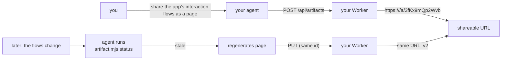

# Open Artifacts  [](LICENSE) [](https://nodejs.org)

**English** | [简体中文](README.zh-CN.md)

Open-source, self-hosted [Claude Code Artifacts](https://code.claude.com/docs/en/artifacts):
let any coding agent publish self-contained HTML/Markdown pages to shareable
URLs, protect them with passwords (zero-knowledge, client-side encryption),
and keep them updated as the project they describe evolves. Runs entirely on
Cloudflare (Workers + D1 + R2), fits in the free tier, no accounts anywhere.

> **Hosted or self-hosted.** [coda0.com](https://coda0.com) is the official
> managed instance, run by the project — point your agent at it for zero-setup
> publishing. Or self-host the engine on your own Cloudflare account (see
> below); it's the same MIT-licensed code either way.



## Give your agent the skill

```sh
npx skills add coda0HQ/open-artifacts -s using-open-artifacts   # project scope (.claude/skills/)
npx skills add coda0HQ/open-artifacts -s using-open-artifacts -g  # or user scope
```

Works with Claude Code and any agent supporting the
[Agent Skills](https://agentskills.io) standard. Then point it at an instance —
the hosted one, or your own:

```sh
export OPEN_ARTIFACTS_URL=https://coda0.com   # hosted; or your self-hosted URL
```

No instance yet? `references/deployment.md` (bundled with the skill) lists
three ways to get one: use the public shared instance with zero setup,
self-host on your own Cloudflare account, or share a team instance, with a
trust-model table for picking based on content sensitivity.

The bundled `SKILL.md` and `references/design.md` teach the agent the design
philosophy: an expert-designer workflow (understand, explore, plan, build,
verify), an explicit anti-AI-slop list, modern CSS power moves, and a
5-direction library (Editorial / Modern minimal / Human / Tech utility /
Brutalist) with ready-to-paste OKLch palettes and font stacks for when no
brand is specified. `references/tokens.css` is the shared token contract the
agent pastes into every page before overriding identity tokens per
direction. Adapted from [open-design](https://github.com/nexu-io/open-design)
and Claude's `artifact-design` skill, retargeted to this project's strict
no-external-requests CSP.

Ask your agent to "publish this as an artifact" — it runs the bundled CLI:

```sh
node .claude/skills/using-open-artifacts/scripts/artifact.mjs create page.html \
  --favicon 📊 --scope "app interaction flows" \
  --channel app-interactions --watch "src/views/**"
```

`--channel <slug>` binds the artifact to a stable URL: reusing the same slug
on a later `create` updates the same link (new version, no new URL), so "the
app-interactions page" always lives at one link across sessions and machines.

## Deploy your own instance

```sh
git clone https://github.com/coda0HQ/open-artifacts && cd open-artifacts
pnpm install
npx wrangler d1 create open-artifacts        # put database_id into wrangler.jsonc
npx wrangler r2 bucket create open-artifacts-content
pnpm run deploy
```

The schema applies itself on first request — no migration step. To restrict
who can create artifacts on your instance (updates are always restricted by
per-artifact write tokens):

```sh
npx wrangler secret put CREATE_TOKEN         # then set OPEN_ARTIFACTS_TOKEN client-side
```

Local development: `pnpm dev` (state persists in `.wrangler/state`).

## How it works

| Concern | Design |
| --- | --- |
| Identity | No accounts. Artifact ids are 12-char crypto-random (unguessable, unlisted). Creation returns a one-time `writeToken`; only its SHA-256 is stored. |
| Channels | A `--channel <slug>` binds an artifact to a stable URL. The CLI keeps a per-channel token (`ch_`) in `.artifacts/credentials.json`; presenting it on a later `create` updates the bound artifact (new version, same link) instead of minting a new one. Only the channel hash is stored server-side. |
| Storage | D1 for metadata/tokens/version index, R2 for content bodies (`content/<id>/<version>`). Both strongly consistent — updates are visible immediately. |
| Versions | Every publish is an immutable version with an optional label and its own title, description, favicon, format, and encryption state, so history reflects what each version actually looked like. `?v=N` views history; `PUT` accepts `baseVersion` and returns 409 on conflicts (override with `force`). |
| Serving | The Worker wraps stored content in a skeleton (CSS reset, emoji favicon, viewport, light/dark theme with a `data-theme` toggle) and serves it with `Content-Security-Policy: sandbox allow-scripts ...; default-src 'none'` — artifact scripts run in an opaque origin and cannot make any external request. |
| Link previews | Every page emits OpenGraph + Twitter tags (title, description, image). `GET /og/:id` returns a 1200x630 PNG card rasterized on the edge with `@resvg/resvg-wasm` from an embedded Inter subset — a real raster crawlers render (they ignore SVG), self-contained with no external requests. |
| Passwords | The CLI encrypts locally: PBKDF2-HMAC-SHA256 (600k iterations) + AES-256-GCM. The server stores only `{salt, iv, ciphertext}`. The viewer serves an unlock shell that decrypts in the browser and renders the result inside a sandboxed iframe. The password never leaves the client. |
| Auto-update | The skill records each artifact's `scope` (what it covers) and `watch` globs plus content hashes in `.artifacts/manifest.json`. `artifact.mjs status` reports artifacts whose watched files changed; agents run it after tasks (or via the optional Claude Code Stop hook: `artifact.mjs install-hook`) and republish when the changes affect the scope. |
| Markdown | Rendered client-side (vendored `marked`, inlined — no CDN), so encrypted Markdown works without the server ever seeing plaintext. |

## API

```
POST   /api/artifacts           { content, favicon, title?, description?, format?, label?, encrypted?, channel? }
                                → 201 { id, url, writeToken, version, channel? }
PUT    /api/artifacts/:id       same fields + baseVersion?/force?   (Bearer writeToken or channel token)
GET    /api/artifacts/:id       metadata + version history
GET    /api/artifacts/:id/raw   stored content (?v=N)
DELETE /api/artifacts/:id       (Bearer writeToken)
GET    /a/:id                   rendered page (?v=N)
```

`encrypted` is `{ salt, iv, iterations }` (all base64/int) with base64
ciphertext as `content`. `channel` is a channel token (`ch_...`) that targets
the artifact already bound to that channel, or binds a new one on first use.
Max content size 4 MiB.

## Security model

- Serving untrusted HTML on your own origin is the classic stored-XSS trap;
  every user-content response here carries the CSP `sandbox` directive
  (opaque origin — no cookies, no storage, no same-origin API calls) plus
  `default-src 'none'`, `connect-src 'none'`, `X-Content-Type-Options:
  nosniff` and `Referrer-Policy: no-referrer`.
- `*.workers.dev` is on the Public Suffix List, isolating your instance from
  other sites.
- Anyone with the URL of an unprotected artifact can read it (like an unlisted
  gist). Use `--password` for anything sensitive; title/favicon metadata stays
  plaintext.
- An open instance (no `CREATE_TOKEN`) lets anyone with the URL create pages.
  Set the secret for anything public-facing.

## Development

```sh
pnpm test          # Worker integration tests (vitest + workerd)
pnpm test:cli      # skill CLI tests
pnpm typecheck
pnpm check         # biome lint + format
```

BDD scenarios live in `tests/features/`; the architecture decision record in
`docs/architecture.md`.

MIT licensed.
