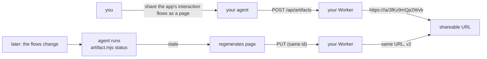

# Open Artifacts  [](LICENSE) [](https://nodejs.org)

**English** | [简体中文](README.zh-CN.md)

Open-source, self-hosted [Claude Code Artifacts](https://code.claude.com/docs/en/artifacts):
let any coding agent publish self-contained HTML/Markdown pages to shareable
URLs, protect them with passwords (zero-knowledge, client-side encryption),
and keep them updated as the project they describe evolves. Runs entirely on
Cloudflare (Workers + D1 + R2 + optional Durable Objects). The neutral engine
supports capability tokens and an injected `Authorizer`; the hardened
production profile is private/team-scoped and fails closed.

> **Hosted or self-hosted.** [coda0.com](https://coda0.com) is the official
> managed instance, run by the project — point your agent at it for zero-setup
> publishing. Or self-host the engine on your own Cloudflare account (see
> below); it's the same MIT-licensed code either way.


```mermaid
flowchart LR
  you["you"] -- "share the app's interaction flows as a page" --> agent["your agent"]
  agent -- "POST /api/artifacts" --> worker["your Worker"]
  worker -- "https://<instance>/a/3fKx9mQp2Wvb" --> url["shareable URL"]
  later["later: the flows change"] --> status["agent runs<br/>artifact.mjs status"]
  status -- "stale" --> regen["regenerates page"]
  regen -- "PUT (same id)" --> worker2["your Worker"]
  worker2 -- "same URL, v2" --> url
```

## Give your agent the skill

```sh
npx skills add coda0HQ/open-artifacts -s using-open-artifacts   # project scope (.claude/skills/)
npx skills add coda0HQ/open-artifacts -s using-open-artifacts -g  # or user scope
```

Works with Claude Code and any agent supporting the
[Agent Skills](https://agentskills.io) standard. Then point it at an instance —
the hosted one, or your own:

```sh
export OPEN_ARTIFACTS_URL=https://coda0.com   # hosted; or your self-hosted URL
```

No instance yet? `references/deployment.md` (bundled with the skill) lists
three ways to get one: use the public shared instance with zero setup,
self-host on your own Cloudflare account, or share a team instance, with a
trust-model table for picking based on content sensitivity.

The bundled `SKILL.md` and `references/design.md` teach the agent the design
philosophy: an expert-designer workflow (understand, explore, plan, build,
verify), an explicit anti-AI-slop list, modern CSS power moves, and a
5-direction library (Editorial / Modern minimal / Human / Tech utility /
Brutalist) with ready-to-paste OKLch palettes and font stacks for when no
brand is specified. `references/tokens.css` is the shared token contract the
Recipe builder injects into every HTML artifact before its theme fragment.
Adapted from
[open-design](https://github.com/nexu-io/open-design),
Claude's `artifact-design` skill,
[impeccable](https://github.com/pbakaus/impeccable) by Paul Bakaus
(Apache-2.0, interaction-state and anti-pattern rules),
Emil Kowalski (easing, frequency, and duration rules), and
Apple WWDC 2018 *Designing Fluid Interfaces* (canvas gesture physics).
Retargeted to this project's strict no-external-requests CSP.

Ask your agent to "publish this as an artifact" — it runs the bundled CLI:

```sh
node skills/using-open-artifacts/scripts/artifact.mjs validate \
  .artifacts/recipes/app-interactions.recipe.json
node skills/using-open-artifacts/scripts/artifact.mjs create \
  .artifacts/recipes/app-interactions.recipe.json
```

Every artifact is generated from a versioned JSON Recipe plus ordered
fragments. The Recipe owns title, favicon, format, scope, watch globs, channel,
level, Canvas mode, locality, and encryption policy. `create` and `update`
compose and validate in memory, then send exactly one final publish request.

## Deploy your own instance

```sh
git clone https://github.com/coda0HQ/open-artifacts && cd open-artifacts
pnpm install
npx wrangler d1 create open-artifacts        # put the id in wrangler.production.jsonc
npx wrangler r2 bucket create open-artifacts-content
pnpm check:environments                       # validates Preview/Staging/Production isolation + dry-runs
```

Apply every numbered D1 migration before deploying. Production requests only
validate schema compatibility and never run DDL. Configure
`PUBLIC_CREATE_MODE`, `ANONYMOUS_COMMENTS`, `RATE_LIMIT_MODE`, and a 32+ byte
`IDEMPOTENCY_SECRET`; production refuses unsafe/missing policy. Provision the
distinct D1/R2/DO/Analytics/rate-limit resources declared by each environment
config and store `IDEMPOTENCY_SECRET` plus `REPAIR_TOKEN` as Worker secrets,
never committed vars. To use token-gated creation, set
`PUBLIC_CREATE_MODE=token` and:

```sh
npx wrangler secret put CREATE_TOKEN --config wrangler.production.jsonc
# then set OPEN_ARTIFACTS_TOKEN client-side
```

Direct `pnpm run deploy` is intentionally blocked. Promote a full committed
SHA through the protected `Gated deployment` workflow; it repeats verification,
builds the selected config, applies migrations, and only then deploys. Release
manifests, Staging rehearsal, Canary thresholds and rollback rules are indexed
in [`docs/releases/`](docs/releases/README.md).

Local development: `pnpm dev` (state persists in `.wrangler/state`).

## How it works

| Concern | Design |
| --- | --- |
| Identity | Artifact ids are 12-char crypto-random. Creation returns a one-time `writeToken`; only its SHA-256 is stored. An injected `Authorizer` can add team/account policy without coupling it to the engine. Credentials support rotate, grace, revoke, status, and manager recovery. |
| Deterministic sources | A strict Recipe plus ordered fragments generates every Artifact. The builder injects tokens and, for Canvas, the vendored runtime and controls. Manifest v2 records Recipe/input/output hashes; direct HTML/Markdown CLI publishing is rejected. |
| Channels | `artifact.channel` binds an artifact to a stable URL. The CLI keeps a per-channel token (`ch_`) in `.artifacts/credentials.json`; presenting it on a later `create` updates the bound artifact (new version, same link) instead of minting a new one. Only the channel hash is stored server-side. |
| Local mode | `artifact.local: true` places private sources under gitignored `.artifacts/recipes.local/` and `.artifacts/fragments.local/`, with state in `manifest.local.json`. Shared Recipes/fragments live under `.artifacts/recipes/` and `.artifacts/fragments/` and may be committed. Encrypted Recipes are always private. |
| Storage | D1 stores metadata/publication state and R2 stores immutable content-addressed bodies. A pending → blob-ready → committed state machine makes only complete content visible; reconciliation handles orphan/missing boundaries. |
| Versions | Every publish is immutable. `?v=N` and the inlined Viewer picker browse history; `PUT` uses version CAS. Live saves a revisioned Draft and only explicit Checkpoint creates the next version—published history is never edited in place. |
| Serving | The Worker wraps stored content in a skeleton (CSS reset, emoji favicon, viewport, light/dark theme with a `data-theme` toggle) and serves it with `Content-Security-Policy: sandbox allow-scripts ...; default-src 'none'` — artifact scripts run in an opaque origin and cannot make any external request. |
| Link previews | Every page emits OpenGraph + Twitter tags (title, description, image). `GET /og/:id` returns a 1200x630 PNG card rasterized on the edge with `@resvg/resvg-wasm` from an embedded Inter subset — a real raster crawlers render (they ignore SVG), self-contained with no external requests. |
| Passwords | The CLI encrypts locally: PBKDF2-HMAC-SHA256 (600k iterations) + AES-256-GCM. The server stores only `{salt, iv, ciphertext}`. The viewer serves an unlock shell that decrypts in the browser and renders the result inside a sandboxed iframe. The password never leaves the client. |
| Auto-update | The Recipe records `scope`, `watch`, and `autoUpdate`; Manifest v2 keeps the publication snapshot. `artifact.mjs status` reports stale watched artifacts, while the optional Stop-hook path only surfaces opted-in entries. Agents update Recipe fragments or `ack` reviewed drift. |
| Markdown | Rendered client-side (vendored `marked`, inlined — no CDN), so encrypted Markdown works without the server ever seeing plaintext. |

## API

```
POST   /api/artifacts           { content, favicon, title?, description?, format?, label?, encrypted?, channel? }
                                → 201 { id, url, writeToken, version, channel? }
PUT    /api/artifacts/:id       same fields + baseVersion?/force?   (Bearer writeToken or channel token)
GET    /api/artifacts/:id       metadata + version history
GET    /api/artifacts/:id/raw   stored content (?v=N)
DELETE /api/artifacts/:id       (Bearer writeToken)
PUT    /api/artifacts/:id/live/draft       revision-CAS Draft save
POST   /api/artifacts/:id/live/checkpoint  immutable Checkpoint publish
GET    /a/:id                   rendered page (?v=N)
```

Clients should send `Open-Artifacts-Protocol: 1`; unsupported explicit
versions fail with `426`. Versioned schemas and Golden Fixtures live in
`protocol/v1/`.

`encrypted` is `{ salt, iv, iterations }` (all base64/int) with base64
ciphertext as `content`. `channel` is a channel token (`ch_...`) that targets
the artifact already bound to that channel, or binds a new one on first use.
Max content size 4 MiB.

## Security model

- Serving untrusted HTML on your own origin is the classic stored-XSS trap;
  every user-content response here carries the CSP `sandbox` directive
  (opaque origin — no cookies, no storage, no same-origin API calls) plus
  `default-src 'none'`, `connect-src 'none'`, `X-Content-Type-Options:
  nosniff` and `Referrer-Policy: no-referrer`.
- `*.workers.dev` is on the Public Suffix List, isolating your instance from
  other sites.
- Anyone with the URL of an unprotected artifact can read it (like an unlisted
  gist). Use `--password` for anything sensitive; title/favicon metadata stays
  plaintext.
- Development may opt into open creation. Production forbids open creation,
  requires explicit anonymous-comment/rate policies, and fails closed when a
  required binding, secret, policy, or migration is missing.

## Development

```sh
pnpm test          # Worker integration tests (vitest + workerd)
pnpm test:cli      # skill CLI tests
pnpm test:security # authorization, abuse, password and quota boundaries
pnpm test:accessibility # two themes, 360px, keyboard and WCAG 2.2 AA
pnpm test:load     # bounded load model + browser smoke
pnpm typecheck
pnpm check         # biome lint + format
pnpm verify        # complete static, contract, operational, audit, and browser gate
```

See `docs/architecture.md`, `protocol/README.md`, `docs/quality-budgets.md`,
and `docs/runbooks/` for the current architecture and operator contract.

MIT licensed.
