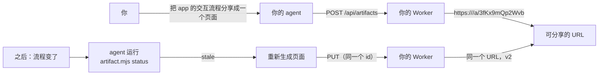

# Open Artifacts  [](LICENSE) [](https://nodejs.org)

[English](README.md) | **简体中文**

开源自托管的 [Claude Code Artifacts](https://code.claude.com/docs/en/artifacts)：
让任意编程 agent 把自包含的 HTML/Markdown 页面发布到可分享的 URL，用密码（零知识、客户端加密）保护，
并在它所描述的项目演进时保持更新。完全跑在 Cloudflare 上（Workers + D1 + R2），
免费额度就够用，任何地方都不需要账号。

> **托管或自托管。** [coda0.com](https://coda0.com) 是由项目官方运营的托管实例——
> 把你的 agent 指向它即可零配置发布；也可以在自己的 Cloudflare 账号上自托管这个引擎
> （见下文），两者是同一份 MIT 许可的代码。



## 给你的 agent 装上技能

```sh
npx skills add coda0HQ/open-artifacts -s using-open-artifacts   # 项目作用域（.claude/skills/）
npx skills add coda0HQ/open-artifacts -s using-open-artifacts -g  # 或用户作用域
```

兼容 Claude Code 以及任何支持
[Agent Skills](https://agentskills.io) 标准的 agent。然后把它指向一个实例——官方托管的，或你自己的：

```sh
export OPEN_ARTIFACTS_URL=https://coda0.com   # 托管实例，或你自托管的 URL
```

还没有实例？随技能附带的 `references/deployment.md` 列了三种获取方式：零配置使用公共共享实例、
在自己的 Cloudflare 账号自托管，或共享一个团队实例，并附信任模型表帮助按内容敏感度选择。

随附的 `SKILL.md` 和 `references/design.md` 教会 agent 设计理念：专家设计师式的工作流
（理解、探索、规划、构建、验证），一份明确的反 AI 套路清单，现代 CSS 实用技巧，
以及一个 5 方向设计库（Editorial / Modern minimal / Human / Tech utility / Brutalist），
内附可直接粘贴的 OKLch 调色板和字体栈，用于未指定品牌时的情况。
`references/tokens.css` 是共享的 token 契约，Recipe 构建器会先注入它，再追加主题片段中的身份 token 覆盖。
改编自 [open-design](https://github.com/nexu-io/open-design)、Claude 的
`artifact-design` 技能、Paul Bakaus 的
[impeccable](https://github.com/pbakaus/impeccable)（Apache-2.0，交互状态与
反模式规则）、Emil Kowalski（缓动/频率/时长规则）以及 Apple WWDC 2018
*Designing Fluid Interfaces*（画布手势物理），重新适配本项目严格的禁止外部请求
CSP。

让你的 agent "把这个发布成 artifact"，它会运行随附的 CLI：

```sh
node skills/using-open-artifacts/scripts/artifact.mjs validate \
  .artifacts/recipes/app-interactions.recipe.json
node skills/using-open-artifacts/scripts/artifact.mjs create \
  .artifacts/recipes/app-interactions.recipe.json
```

每个 Artifact 都由版本化 JSON Recipe 和有序片段生成。Recipe 记录标题、favicon、
格式、scope、watch glob、channel、等级、Canvas 模式、本地性和加密策略。
`create` 与 `update` 在内存中组合并验证，最后只发送一次发布请求。

## 部署你自己的实例

```sh
git clone https://github.com/coda0HQ/open-artifacts && cd open-artifacts
pnpm install
npx wrangler d1 create open-artifacts        # 把 database_id 写进 wrangler.jsonc
npx wrangler r2 bucket create open-artifacts-content
pnpm run deploy
```

Schema 在首次请求时自动建好，无需迁移步骤。要限制谁能在你的实例上创建 artifact
（更新始终由每个 artifact 自己的 write token 限制）：

```sh
npx wrangler secret put CREATE_TOKEN         # 然后客户端设置 OPEN_ARTIFACTS_TOKEN
```

本地开发：`pnpm dev`（状态持久化在 `.wrangler/state`）。

## 工作原理

| 关注点 | 设计 |
| --- | --- |
| 身份 | 无账号。Artifact id 是 12 位加密随机串（不可猜、不列出）。创建时返回一次性的 `writeToken`，只存其 SHA-256。 |
| 确定性来源 | 每个 Artifact 都由严格 Recipe 和有序片段生成。构建器注入 tokens；Canvas 还会注入 vendored runtime 与控制器。Manifest v2 记录 Recipe/input/output 哈希，CLI 拒绝直接发布 HTML/Markdown。 |
| 频道 | `artifact.channel` 把 artifact 绑定到稳定 URL。CLI 把每个频道的 token（`ch_`）保存在 `.artifacts/credentials.json`；之后用它在 `create` 上更新绑定的 artifact（新版本、同一链接），而不是新建一个。服务端只存频道哈希。 |
| 本地模式 | `artifact.local: true` 把私有来源放在 gitignore 的 `.artifacts/recipes.local/` 与 `.artifacts/fragments.local/`，状态放在 `manifest.local.json`。共享 Recipe/片段放在 `.artifacts/recipes/` 与 `.artifacts/fragments/`，可以提交；加密 Recipe 必须保持私有。 |
| 存储 | D1 存元数据/token/版本索引，R2 存内容体（`content/<id>/<version>`）。两者都是强一致的，更新立即可见。 |
| 版本 | 每次发布都是一个不可变版本，带可选 label 和各自的 title、description、favicon、format、加密状态，因此历史反映每个版本真实的样子。`?v=N` 查看历史；`PUT` 接受 `baseVersion`，冲突时返回 409（用 `force` 覆盖）。 |
| 服务 | Worker 把存储内容包进一个骨架（CSS reset、emoji favicon、viewport、带 `data-theme` 切换的浅色/深色主题），并以 `Content-Security-Policy: sandbox allow-scripts ...; default-src 'none'` 提供——artifact 脚本跑在不透明源里，无法发起任何外部请求。 |
| 链接预览 | 每个页面都输出 OpenGraph + Twitter 标签（标题、描述、图片）。`GET /og/:id` 用 `@resvg/resvg-wasm` 在边缘从内嵌的 Inter 子集栅格化出一张 1200x630 的 PNG 卡片——爬虫真正能渲染的位图（它们不认 SVG），自包含、无任何外部请求。 |
| 密码 | CLI 在本地加密：PBKDF2-HMAC-SHA256（60 万次迭代）+ AES-256-GCM。服务端只存 `{salt, iv, ciphertext}`。查看器提供一个解锁外壳，在浏览器里解密并渲染进一个沙箱 iframe。密码永不离开客户端。 |
| 自动更新 | Recipe 记录 `scope`、`watch` 和 `autoUpdate`，Manifest v2 保存发布快照。`artifact.mjs status` 报告过期 Artifact；可选 Stop hook 只展示主动开启自动更新的条目。Agent 更新 Recipe 片段，或对已审查的漂移执行 `ack`。 |
| Markdown | 客户端渲染（vendored 的 `marked`，内联——无 CDN），这样加密的 Markdown 也能在服务端永远看不到明文的情况下工作。 |

## API

```
POST   /api/artifacts           { content, favicon, title?, description?, format?, label?, encrypted?, channel? }
                                → 201 { id, url, writeToken, version, channel? }
PUT    /api/artifacts/:id       同上字段 + baseVersion?/force?   （Bearer writeToken 或 channel token）
GET    /api/artifacts/:id       元数据 + 版本历史
GET    /api/artifacts/:id/raw   存储内容（?v=N）
DELETE /api/artifacts/:id       （Bearer writeToken）
GET    /a/:id                   渲染页面（?v=N）
```

`encrypted` 是 `{ salt, iv, iterations }`（均为 base64/int），base64 密文作为 `content`。
`channel` 是频道 token（`ch_...`），指向已绑定该频道的 artifact，首次使用时则绑定新 artifact。
最大内容体积 4 MiB。

## 安全模型

- 在你自己的源上提供不受信任的 HTML 是经典的存储型 XSS 陷阱；这里每个用户内容响应都带
  CSP `sandbox` 指令（不透明源——无 cookie、无存储、无同源 API 调用），外加
  `default-src 'none'`、`connect-src 'none'`、`X-Content-Type-Options: nosniff`
  和 `Referrer-Policy: no-referrer`。
- `*.workers.dev` 在公共后缀列表上，把你的实例与其他站点隔离。
- 任何拿到未受保护 artifact URL 的人都能读它（类似 unlisted gist）。敏感内容用 `--password`；
  title/favicon 元数据仍是明文。
- 开放实例（无 `CREATE_TOKEN`）让任何拿到 URL 的人都能创建页面。面向公网时请设置该 secret。

## 开发

```sh
pnpm test          # Worker 集成测试（vitest + workerd）
pnpm test:cli      # 技能 CLI 测试
pnpm typecheck
pnpm check         # biome lint + format
```

BDD 场景在 `tests/features/`；架构决策记录在 `docs/architecture.md`。

MIT 协议。
