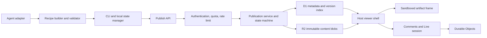

# Open Artifacts Foundation Hardening Specification

- Status: Superseded as an implementation checklist by `docs/project-plan.md`; retained as the fixed-baseline hardening specification
- Date: 2026-08-04
- Upstream: <https://github.com/coda0HQ/open-artifacts>
- Audited baseline: `a03a8c3721dd0021c78ea24533d6f7a7f4af07b3`
- Intended use: a maintained, self-hosted artifact platform fork—not an unmodified production dependency

## 1. Executive decision

Open Artifacts is a credible product kernel and a good reference implementation. It is suitable today for an internal prototype. It can become a team-grade, self-hosted platform after the P0 work in this specification. The audited `main` branch should not be used unchanged for a customer-facing production service.

The strategic reason to adopt it is not merely “turn text into HTML.” Its useful core is the artifact lifecycle: an agent produces a reproducible Recipe, the system publishes it at a stable URL, preserves source relationships and versions, applies a constrained viewer runtime, and optionally supports comments, Live editing, and handoff back to an agent.

If the requirement is only to create and maintain a shareable website, ChatGPT Sites is the lower-maintenance default. Open Artifacts becomes compelling when one or more of these are requirements:

- self-hosting and ownership of the runtime and data;
- use by multiple agents or coding environments rather than a single managed product;
- auditable Recipe/Manifest/hash-based provenance;
- a programmable artifact pipeline that can be extended as product infrastructure;
- control over authentication, retention, domains, comments, and deployment policy.

## 2. Baseline quality assessment

The baseline was inspected and tested on 2026-08-04.

### 2.1 Evidence

| Check | Result |
| --- | --- |
| Worker tests | 26 files, 342 tests passed |
| CLI tests | 4 files, 149 tests passed |
| TypeScript check | Passed, with the caveat that CLI `.mjs` files are not actually covered by the current configuration |
| Formatting/static check | 93 files passed |
| BDD specifications | 24 feature specifications present |
| Real-browser Live E2E | Failed reproducibly twice after inline copy-edit Save; expected “Apply copy edits (1)” did not appear |
| Production dependency audit | One moderate Hono advisory; patch available |
| Full dependency audit | Two high and five moderate findings, mostly in the Cloudflare development toolchain rather than the deployed Worker |

### 2.2 Strengths to preserve

- Clear conceptual separation among agent skill, CLI, publish API, viewer, metadata store, object store, and real-time sessions.
- Recipe, Manifest, content hash, and source-watch concepts provide stronger provenance than a disposable generated page.
- Security-sensitive choices are deliberate: sandboxed viewer, restrictive CSP, hashed server-side tokens, strict input validation, and client-side PBKDF2/AES-256-GCM password encryption.
- Existing `ArtifactStore` and authorizer seams make hardening and extension feasible.
- Test density is unusually good for a young project.
- MIT licensing permits a maintained fork.

### 2.3 Production blockers

1. Publication can advance the D1 `current_version` pointer before all R2 and version-row writes have succeeded. A partial failure can expose an incomplete latest version.
2. The real-browser Live copy-edit flow is currently red and must be diagnosed before production claims are made.
3. There are no required CI gates, and the repository guidance permits direct production deployment.
4. CLI `.mjs` files are not genuinely typechecked by the reported typecheck command.
5. Public create/comment/Live surfaces lack complete rate limiting, total quotas, and abuse controls.
6. Local credential and manifest writes are not atomic or locked; concurrent agents can lose the only usable write token.
7. Live edit can replace the current version in place, weakening the meaning of immutable version history.
8. Schema changes are applied lazily on requests rather than through a versioned, observable migration process.
9. The project has no tagged releases, is young, has a small maintainer base, and contains documentation/package-metadata drift.
10. Cloudflare D1, R2, Durable Objects, `HTMLRewriter`, and static asset bindings are architectural dependencies; moving to another provider is a refactor, not a configuration switch.

## 3. Goals and non-goals

### 3.1 Goals

- A published version is either fully readable or not visible at all.
- Concurrent publishers cannot silently overwrite one another.
- Historical versions have explicit, testable semantics.
- Production deployment is gated by repeatable tests and security checks.
- Public endpoints have bounded cost and abuse resistance.
- Local agent state survives crashes and concurrent processes.
- Operators can migrate, observe, back up, restore, and repair the service.
- Cloudflare remains a first-class deployment target while provider-specific dependencies are isolated behind explicit seams.

### 3.2 Non-goals

- Building a general-purpose CMS or visual website builder.
- Reproducing every ChatGPT Sites feature.
- Achieving provider-neutral deployment in the first hardening milestone.
- Supporting arbitrary server-side execution from an artifact.
- Replacing the sandbox with direct execution in the host page origin.
- Guaranteeing backward compatibility with every upstream change after the fork.

## 4. Users and core use cases

| User | Primary need |
| --- | --- |
| Artifact author | Publish a Recipe or generated artifact and update it without losing provenance |
| Agent/runtime integrator | Use the same artifact protocol from Codex, Claude Code, or another agent |
| Viewer/commenter | Open a stable, safe URL and optionally leave controlled feedback |
| Platform operator | Enforce access, quotas, retention, migrations, recovery, and observability |
| Product team | Iterate from feedback while retaining an understandable version history |

Required use cases are create, update, view latest, view a specific version, compare status with source hashes, comment, password-protect, revoke or rotate credentials, perform a Live editing session, and hand an artifact back to an agent.

## 5. Target architecture

Cloudflare is the v1 deployment target. Provider-specific construction must live in a composition root. Domain services should depend on interfaces for metadata, blobs, real-time sessions, rate limits, and clocks rather than importing Cloudflare bindings directly.

### 5.1 Publication state model

Each attempted publication has one of these states:

- `pending`: accepted but not visible;
- `blob_ready`: immutable content is present and its hash has been verified;
- `committed`: the version row and latest pointer were committed together and are visible;
- `conflict`: a compare-and-swap check found a newer writer;
- `failed`: an unrecoverable error was recorded;
- `expired`: a repair or garbage-collection job closed an abandoned attempt.

Recommended write sequence:

1. Validate and normalize the Recipe; calculate the content hash and idempotency key.
2. Insert a non-visible `pending` publication containing the expected current version.
3. Write the artifact to an immutable, content-addressed R2 key.
4. verify the object with metadata or a read-back check, then mark it `blob_ready`.
5. In one D1 transaction, insert the immutable version row, compare-and-swap the artifact pointer, and mark the publication `committed`.
6. On a compare-and-swap failure, return `409 Conflict`; never move the latest pointer.
7. Reconcile abandoned publications and delete unreferenced blobs after a retention window.

An idempotent retry with the same artifact, actor, and idempotency key must return the original committed result. A visible version must never reference a missing blob.

## 6. Requirements

### P0-REL-001 — Atomic publication visibility

The publication service must implement the state model in section 5.1 for create, update, and any operation that changes the current version.

Acceptance criteria:

- Failure injection exists before and after every D1 and R2 boundary.
- No injected failure produces a latest pointer whose content cannot be read.
- Concurrent updates use compare-and-swap semantics; one wins and the other returns a machine-readable `409` response.
- Retries are idempotent and do not create duplicate visible versions.
- A repair job reports and resolves stale pending rows and unreferenced objects.
- Read paths reject non-committed versions.

### P0-CI-001 — Required delivery gates

Every pull request and protected main-branch change must run a pinned toolchain and a required CI workflow.

Acceptance criteria:

- CI runs formatting/static checks, real TypeScript/JavaScript typechecking, worker tests, CLI tests, migration tests, and browser E2E tests.
- Browser E2E covers publish, view, password unlock, comment, Live connect, inline copy edit, apply edits, and handoff.
- The currently reproducible “Apply copy edits (1)” failure is fixed or converted into a documented, intentionally changed assertion.
- Production dependencies have no unaccepted high or critical advisory; the Hono advisory is patched.
- Deployment can start only from a commit that passed all required checks.
- Direct production deployment from an unreviewed local tree is disabled in the documented process.

### P0-SEC-001 — Abuse resistance and bounded cost

All mutating and real-time surfaces must have an explicit authorization, rate, and quota policy.

Acceptance criteria:

- Public artifact creation is closed by default and requires an explicitly configured policy.
- Create, update, password attempts, comments, and Live connections have per-actor and per-resource limits.
- Storage, version count, comment count, payload size, and concurrent session quotas are enforced.
- Limits return `429` or an appropriate `4xx` response with retry guidance and are observable by the operator.
- Anonymous comments are either disabled by default or protected by a documented anti-abuse mechanism.
- Security tests cover token guessing, password brute force, oversized input, connection floods, and stored-content injection.

### P0-AUTH-001 — Credential lifecycle

Artifact and service credentials must support creation, rotation, revocation, and operator-approved recovery without exposing raw secrets server-side.

Acceptance criteria:

- Server records store token identifiers and strong hashes, not raw write tokens.
- Rotation is atomic, auditable, and can revoke the old credential immediately or after an explicit grace period.
- A lost artifact token has a documented owner/admin recovery path.
- API keys and raw passwords are never written into a shareable Manifest or Recipe.
- Local secret storage is separated from non-secret artifact metadata; OS keychain or an external secret manager is supported for production use.
- Logs, exceptions, and analytics redact all credentials.

### P0-STATE-001 — Crash-safe local agent state

CLI updates to credentials, manifests, and source hashes must be atomic and safe under concurrent agent processes.

Acceptance criteria:

- Files are written to a same-filesystem temporary file, flushed, permissioned to `0600` when secret-bearing, and atomically renamed.
- A per-artifact lock or compare-and-swap mechanism prevents lost updates.
- Stale-lock recovery is bounded and documented.
- Crash and concurrency tests prove the previous valid file remains readable and tokens are not lost.
- Corrupt state is detected with a useful recovery message rather than silently replaced.

### P0-MIG-001 — Versioned schema and recovery operations

Production schema changes must be explicit deployment operations, not lazy request-time side effects.

Acceptance criteria:

- D1 migrations have monotonically versioned files and a migration ledger.
- Application startup can verify compatibility but cannot silently mutate production schema.
- Forward migration, rollback/roll-forward policy, backup, restore, and point-in-time recovery are documented.
- A restore drill is automated in a non-production environment.
- Deployments fail safely when application and schema versions are incompatible.

### P0-VERS-001 — Explicit version and Live semantics

Published historical versions must be immutable. Live edits must not silently change the bytes addressed by an existing published version.

Recommended behavior: Live changes are draft revisions; an explicit checkpoint creates a new published version and advances the latest pointer.

Acceptance criteria:

- An architecture decision record defines draft, revision, checkpoint, published version, and rollback behavior.
- Fetching a historical version by identifier always returns the same content hash.
- The viewer clearly distinguishes unsaved draft changes from a published checkpoint.
- Recovery from a dropped Live connection cannot overwrite a newer checkpoint.
- Tests cover two editors, stale saves, rollback, reconnect, and handoff with pending drafts.

### P0-TEST-001 — Browser and boundary-test coverage

The viewer wrapper and CLI must have tests below the end-to-end layer so regressions can be localized.

Acceptance criteria:

- DOM-level tests cover viewer toolbar, version picker, copy-edit pill, comments, password state, and postMessage validation.
- CLI tests cover malformed Recipes, atomic state writes, locks, retries, credential rotation, and conflicting updates.
- Browser tests run against a supported pinned browser matrix with captured traces on failure.
- Failure-injection tests cover all publication state transitions.
- Flaky tests are quarantined only with an owner, issue, and expiry date; they cannot be silently ignored.

### P0-OPS-001 — Observability and repair

Operators must be able to understand failed publications, abuse, degraded Live sessions, and storage growth.

Acceptance criteria:

- Structured logs include request, artifact, publication, version, and actor identifiers without secrets.
- Metrics cover request outcomes, publish latency, state-machine failures, stale publications, rate limits, R2/D1 failures, Live connections, and storage growth.
- A repair command supports dry-run and auditable execution.
- Alerts exist for missing blobs, rising failure ratios, repeated auth failures, and migration incompatibility.
- A runbook covers partial publication, token loss, restore, abuse, and upstream rollback.

### P1-PORT-001 — Provider isolation

Provider portability is an architectural option, not a P0 promise.

Acceptance criteria:

- The composition root injects `MetadataStore`, `BlobStore`, `RealtimeSessionStore`, `RateLimiter`, `Clock`, and `IdGenerator` implementations.
- Core publication tests run against in-memory contract implementations with no Cloudflare globals.
- Cloudflare-specific behavior is documented in one deployment adapter.
- A portability spike demonstrates one alternate metadata/blob combination before any provider-neutral claim is made.

### P1-MAINT-001 — Decompose high-risk modules

Large inline runtime and CLI modules must be separated along behavior boundaries without changing the external protocol.

Acceptance criteria:

- Viewer host rendering, sandbox policy, toolbar state, comments, Live transport, copy editing, and version UI are independently testable modules.
- CLI parsing, validation, HTTP transport, credential storage, manifest storage, watch mode, and commands are independently testable modules.
- Protocol schemas are centralized and versioned.
- Bundle-size and performance budgets prevent decomposition from degrading load time.

## 7. Security model

| Threat | Required control |
| --- | --- |
| Malicious artifact HTML/JavaScript | Keep the opaque-origin sandbox and strict CSP; validate all host/frame messages by origin model, schema, and capability |
| Token theft | Hash server-side, redact logs, separate local secret storage, rotate/revoke, minimize URL exposure |
| Password brute force | Rate limits, exponential backoff, monitoring, and a minimum work factor policy |
| Spam and resource exhaustion | Closed-by-default creation, actor/resource quotas, payload limits, connection limits, retention |
| Cross-artifact data access | Scope every query and real-time channel to an authorized artifact and capability |
| Partial D1/R2 failure | Immutable blobs, transactional metadata commit, reconciliation, and failure-injection tests |
| Supply-chain compromise | Lockfiles, pinned CI/runtime versions, dependency review, build provenance, and gated deployment |
| Secret leakage through Recipe/Manifest | Schema-level secret exclusion plus tests and pre-publish scanning |

The existing sandbox and client-side encryption design should be preserved unless a formal threat-model review approves a replacement. Encryption does not replace access control, rate limiting, or metadata privacy.

## 8. Deployment and operating model

The first supported production topology remains Cloudflare Workers + D1 + R2 + Durable Objects + static assets. This minimizes unnecessary rewrite risk while the reliability model is corrected.

Required environments:

- local development with isolated disposable data;
- preview per pull request or branch;
- staging with production-like bindings and migration rehearsal;
- production with protected secrets, backups, alerts, and a controlled deploy identity.

Configuration must be validated at startup. Production should fail closed if creation policy, secrets, migrations, or required bindings are absent. A release is an immutable git commit plus schema version and build provenance; it is not an arbitrary local working tree.

## 9. Verification strategy

1. Unit tests validate normalization, schemas, auth decisions, state transitions, and UI reducers.
2. Contract tests validate every store and rate-limiter implementation.
3. Integration tests use local D1/R2 equivalents and inject failures at each boundary.
4. Browser E2E validates the complete viewer, comment, Live, copy-edit, and handoff paths.
5. Security tests exercise sandbox escape attempts, forged messages, token/password attacks, and resource limits.
6. Operational tests rehearse migration, backup, restore, stale-publication repair, and rollback.
7. A small load test validates publish/read/comment/Live quotas and cost assumptions before external launch.

Production-readiness exit criteria:

- Every P0 acceptance criterion is met and linked to evidence.
- Required CI is green on the release commit.
- No unexplained browser E2E failure remains.
- No unaccepted high or critical production vulnerability remains.
- Failure-injection proves no visible missing-content state.
- A restore and repair drill succeeds in staging.
- The operator runbook and ownership rotation are complete.

## 10. Implementation sequence

### Phase 0 — Fork and decisions

- Fork the repository and pin the audited baseline.
- Record ownership, upstream-sync policy, and release policy.
- Decide internal-only versus external service, Cloudflare commitment, anonymous comments, and Live version semantics.

### Phase 1 — Delivery safety

- Add required CI and protected deployment flow.
- Make `.mjs` typechecking real.
- Patch Hono and review the remaining advisories.
- Reproduce and fix the Live copy-edit browser failure.

### Phase 2 — Data integrity

- Implement the publication state machine, immutable blob keys, compare-and-swap, idempotency, repair, and failure-injection tests.
- Introduce versioned migrations and backup/restore rehearsal.
- Make local state writes atomic and locked.

### Phase 3 — Security and operations

- Add credential lifecycle, rate limits, quotas, comment policy, structured telemetry, alerts, and runbooks.
- Complete the threat-model review and external-launch checklist.

### Phase 4 — Product semantics and maintainability

- Implement draft/checkpoint Live semantics.
- Decompose the viewer wrapper and CLI modules.
- Centralize and version protocol schemas.

### Phase 5 — Optional portability

- Isolate Cloudflare composition and run an alternate-provider spike.
- Commit to a second provider only if product demand justifies its ongoing test and operations cost.

## 11. Open product decisions

1. Is the first real deployment internal-only, partner-facing, or fully public?
2. Is self-hosting a hard requirement, or would ChatGPT Sites cover most of the actual workflow?
3. Must artifacts be writable by multiple agents concurrently?
4. Are anonymous comments required? If so, what moderation and identity model is acceptable?
5. Should every Live save create a version, or should Live use drafts with explicit checkpoints?
6. Is Cloudflare lock-in acceptable for the next 12–18 months?
7. What are the retention, deletion, export, and data-residency requirements?
8. Who owns security response, upstream merges, releases, and on-call operation of the fork?

## 12. References

- Open Artifacts README (Chinese): <https://github.com/coda0HQ/open-artifacts/blob/main/README.zh-CN.md>
- Architecture: <https://github.com/coda0HQ/open-artifacts/blob/main/docs/architecture.md>
- Audited store implementation: <https://github.com/coda0HQ/open-artifacts/blob/a03a8c3721dd0021c78ea24533d6f7a7f4af07b3/src/store.ts#L594-L763>
- Audited local state implementation: <https://github.com/coda0HQ/open-artifacts/blob/a03a8c3721dd0021c78ea24533d6f7a7f4af07b3/skills/using-open-artifacts/scripts/artifact.mjs#L179-L194>
- Current Live overwrite semantics: <https://github.com/coda0HQ/open-artifacts/blob/a03a8c3721dd0021c78ea24533d6f7a7f4af07b3/skills/using-open-artifacts/references/live.md#L68-L76>
- Deployment guidance in audited repository: <https://github.com/coda0HQ/open-artifacts/blob/a03a8c3721dd0021c78ea24533d6f7a7f4af07b3/AGENTS.md#L12-L20>
- Viewer modularization issue: <https://github.com/coda0HQ/open-artifacts/issues/34>
- CLI typecheck issue: <https://github.com/coda0HQ/open-artifacts/issues/42>
- Abuse-control issue: <https://github.com/coda0HQ/open-artifacts/issues/18>
- Hono advisory: <https://github.com/advisories/GHSA-8j4g-w8fx-2239>
- ChatGPT Sites help: <https://help.openai.com/en/articles/20001339-creating-and-managing-chatgpt-sites>
- ChatGPT Sites overview: <https://openai.com/academy/chatgpt-sites/>
- Claude Code Artifacts: <https://code.claude.com/docs/en/artifacts>
