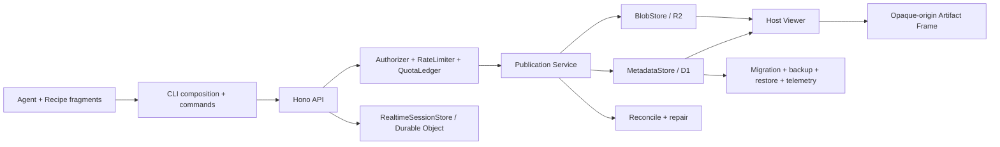

# Open Artifacts Foundation architecture

Open Artifacts Foundation is a maintainable, self-hosted Artifact lifecycle engine pinned to upstream baseline `a03a8c3721dd0021c78ea24533d6f7a7f4af07b3`. An Agent builds deterministic Recipe sources, the CLI publishes them, and a Cloudflare Worker serves immutable versions through a constrained Viewer. The first production boundary is a private/team-scoped deployment; a public multi-tenant service is a separate product decision.

## System map

The domain-facing ports are `MetadataStore`, `BlobStore`, `RateLimiter`, `QuotaLedger`, `RealtimeSessionStore`, `Clock`, and `IdGenerator`. Memory and Cloudflare implementations run shared contracts. Cloudflare-specific construction and feature flags live in `src/adapters/cloudflare/composition.ts`; domain services do not read Cloudflare globals.

## Publication and version invariants

D1 and R2 cannot share a physical transaction. Atomic visibility therefore uses an explicit Publication state machine:

1. create or replay an actor-scoped idempotent `pending` Publication;
2. write an immutable, hash-verified R2 Blob;
3. transition to `blob_ready`;
4. commit version metadata, latest pointer, audit row, and `committed` state in one D1 batch guarded by version CAS;
5. expose only `committed` versions.

A CAS loser returns a structured `409`; the same idempotency key and canonical request replays the original receipt, while a different request fails. A missing Blob can never become latest. Reconciliation classifies stale publications, missing Blobs, and orphan Blobs with paginated, resumable, audited repair commands.

Every published version is immutable. Rollback copies a selected historical version into a new version. Live writes a separate revision-CAS Draft with lease/expiry metadata; only an explicit Checkpoint publishes the Draft as the next immutable version. Disconnect, stale-base, or revision conflicts preserve user work.

## Storage and schema lifecycle

- D1 owns artifact/version/publication metadata, hashes, credential lifecycle, comments, quota reservations, audit rows, and the Live Draft index.
- R2 owns immutable content-addressed bodies and handoff media/events.
- Durable Objects own real-time coordination and persisted Draft/session state when `LIVE_DO` is bound.

Numbered SQL files in `migrations/` are the only production schema mutation path. Deployments apply migrations before application rollout. Requests and readiness probes validate the supported schema version and return not-ready on incompatibility; production request handling never executes DDL. Fresh and upgraded databases must converge under `pnpm test:migrations`.

## Authorization, abuse, and cost boundaries

The engine combines an injected `Authorizer` with scoped capabilities (`wt_`, `ch_`, managed `sk_` where provided). The executable authorization matrix denies unknown route/verb combinations and separates create, view, write, manage, comment, Live, and repair authority. Credential material is hashed at rest or kept in the OS/file Secret Store; rotation, grace, revocation, recovery, and audit are explicit.

A low-latency `RateLimiter` protects floods, while the exact D1-backed `QuotaLedger` bounds storage, versions, comments, handoff bytes, daily writes, and concurrent Live sessions. Production forbids open creation and requires explicit anonymous-comment and rate policies. Invalid/missing bindings, policies, secrets, or schema fail closed.

## Viewer trust zones

The Host Viewer is trusted service chrome. It owns same-origin API/WebSocket calls, Toolbar, Version, Comments, Live, Handoff, password state, and the guarded bridge. Artifact content runs in an iframe/response sandbox with an opaque origin and strict CSP: no cookies, storage, ambient credentials, or arbitrary network access. Host↔Frame messages validate the exact Window identity; frame messages never select a URL, method, headers, or endpoint for a Host request.

Browser runtime sources are reviewed modules under `src/viewer/runtime/` and typed state/parsers under `src/viewer/`. `scripts/build-viewer-runtime.mjs` creates deterministic `src/generated/viewer-runtime.ts`, rejecting external requests, `eval`, `new Function`, and unsafe frame networking. Every inline script receives the per-request nonce.

## CLI and protocol

The CLI root only parses arguments, composes dependencies, and dispatches. Commands live in `skills/using-open-artifacts/scripts/commands/`; atomic State/Manifest, locking, Transport, Watch, Secret Store, validation, and cryptography live in `scripts/lib/`. State writes use a lock, checksum, private mode where needed, temporary file, fsync, and atomic rename; corruption is quarantined rather than overwritten.

`protocol/v1/` is the shared Create/Update/Manifest/Live/Error boundary. Clients advertise `Open-Artifacts-Protocol: 1`; unsupported explicit versions fail with `426`. Worker, CLI, and Viewer consume the same Golden Fixtures, and the checked catalog hash makes protocol drift reviewable. Incompatible changes require a new major directory and the documented dual-read window.

## Operations and delivery

Structured telemetry carries request, artifact, publication, version, actor, and trace identifiers through API/D1/R2/DO operations with centralized redaction. Metrics cover every P0 risk and drive owned alerts/runbooks. Daily encrypted D1 export uses separate-account storage; staging restore validates schema, counts, sampled hashes, Viewer read, and unauthorized-write rejection. Load profiles and quality budgets gate bundle size, generated runtime, source concentration, latency, and memory.

Preview, Staging, and Production use isolated D1/R2/DO/Worker identities and explicit feature policies. CI requires format, generated-output, protocol, docs, budgets, type, secrets, Worker/CLI/contract/migration/DOM/ops/browser tests, and dependency audit. Deployment and release workflows consume the same commit and require environment approval; production promotion follows canary observation with kill switches.

## Current references

- [Protocol compatibility](../protocol/README.md)
- [Quality budgets](quality-budgets.md)
- [Authorization matrix](security/authorization-matrix.md)
- [Threat model](security/threat-model.md)
- [SLO and error budget](ops/slo.md)
- [Runbooks](runbooks/)
- [Complete implementation plan](project-plan.md)
