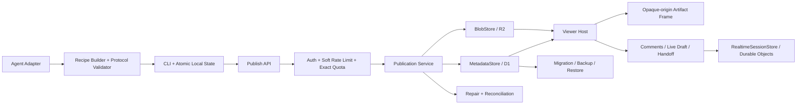
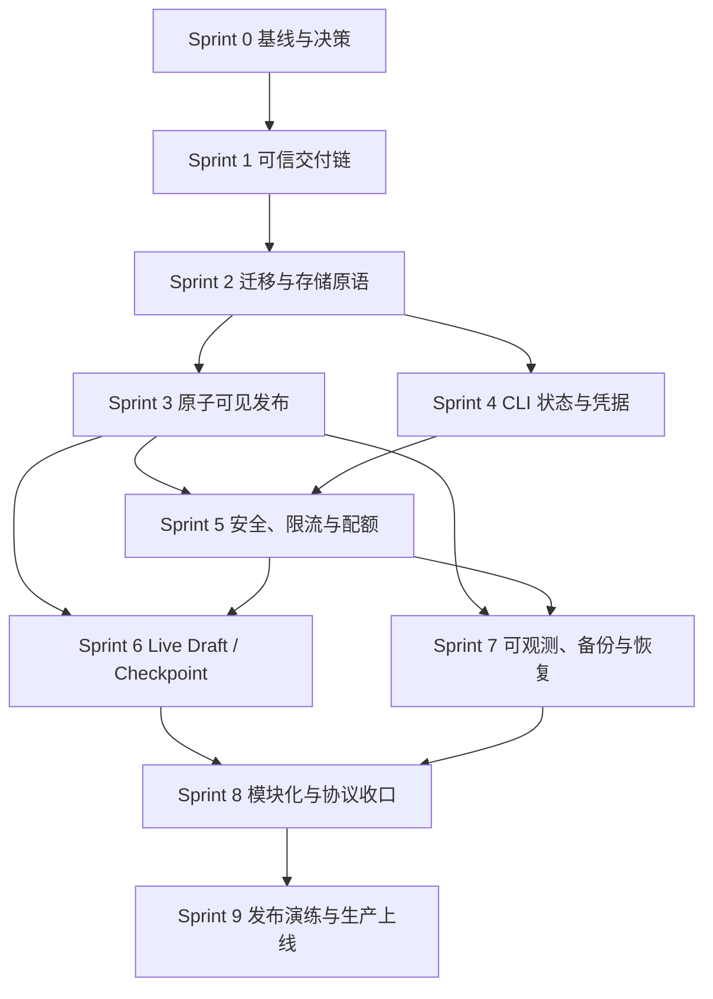

# Open Artifacts Foundation 完整项目实施计划

- **生成日期**：2026-08-04
- **计划状态**：Repository implementation verified；Sprint 0–8 与 Sprint 9 发布控制已实施，本地 `pnpm verify` 全绿；远端 Staging、非作者审批、RC Tag、Canary 与 Production 晋级仍为外部门禁
- **复杂度**：High
- **参考节奏**：10 个两周 Sprint（Sprint 0–9，共约 20 周）
- **适用团队**：建议 3–5 人跨职能小组；若实际人数更少，应保持依赖顺序并顺延，不应压缩质量门槛
- **规划基线**：上游提交 `a03a8c3721dd0021c78ea24533d6f7a7f4af07b3`
- **本计划目标**：从“可用的内部原型与产品内核”推进到“可维护、可恢复、可审计的团队级 Cloudflare 生产版本”

> 本仓库已从固定上游提交建立维护型基础树，并包含源码、测试、迁移、环境配置与运维资产。本计划同时作为实施清单与最终验证证据索引；外部 Production 晋级仍受凭据、审批和 Canary 观察门禁约束。

> 2026-08-04 本地最终证据：Worker 57 文件/465 项、CLI 16/189、Ops 18/43、DOM 2/23、迁移 3/11 + Fresh/Retry 验证、Chromium E2E 12/12 全部通过；生产依赖审计无已知漏洞，Secret Scan 覆盖 529 个文件，Preview/Staging/Production 三套 Wrangler dry-run 通过。该证据验证仓库实现，不冒充远端 Cloudflare 演练或独立人工批准。

## 1. 计划摘要

Open Artifacts 的核心价值不是单次生成 HTML，而是完整的 Artifact 生命周期：Agent 通过确定性的 Recipe 与片段生成内容，系统发布到稳定 URL，保留 Manifest、哈希、版本和来源关系，并提供受限 Viewer、评论、Live 编辑及回交 Agent 的闭环。

现有上游已经具备可信的产品内核和较高测试密度，但生产加固仍被以下问题阻塞：

1. D1 最新版本指针、R2 内容对象和版本行之间没有原子可见性；失败时可能暴露缺失内容的“最新版本”。
2. Live E2E 的 copy-edit 路径可稳定复现失败，且 Live 会原地覆盖当前历史版本。
3. 没有必需 CI、受保护发布流程和可信的 CLI `.mjs` 类型检查。
4. 公共创建、评论、密码尝试和 Live 连接没有完整限流、精确配额及滥用治理。
5. CLI Manifest 与凭据写入没有原子替换和进程锁，凭据缺少完整轮换、撤销和恢复生命周期。
6. Schema 在请求期间惰性变更，缺少版本化迁移、兼容性检查、备份恢复演练和修复流程。
7. `src/wrap.ts` 与 CLI 主脚本高度集中，浏览器脚本主要靠字符串断言，难以定位回归和验证安全边界。
8. 上游文档存在漂移：例如 `TODO.md` 仍将版本选择器列为未实现，部署文档仍宣称“无需迁移”，而代码和加固规格已不同。

实施策略是先建立可信交付链，再修复数据一致性；随后并行推进 CLI 状态安全、凭据生命周期、安全配额、Live 版本语义和运维能力；最后完成模块化、全链路演练及受控生产发布。跨 D1/R2 无法实现物理上的单事务，因此目标是通过不可变 Blob、发布状态机和单次 D1 提交实现**原子可见性**。

## 2. 默认产品边界与规划假设

以下为默认执行假设；Sprint 0 必须通过 ADR 明确确认。若结论变化，应重排后续任务，而不是在实现中隐式分叉。

| 决策项 | 默认结论 | 对计划的影响 |
| --- | --- | --- |
| 首个生产边界 | 团队内部或受邀伙伴使用的自托管服务 | Sprint 9 可发布；完全公开服务需额外门槛 |
| 部署平台 | Cloudflare Workers + D1 + R2 + Durable Objects | P0 不承诺供应商中立 |
| Cloudflare 锁定期 | 接受未来 12–18 个月为一等目标 | 先抽象端口，不为第二供应商提前重写 |
| 创建策略 | 生产默认关闭匿名创建 | 必须显式配置身份或创建策略 |
| 评论策略 | 生产默认关闭匿名评论 | 开启匿名评论前必须有反滥用与审核方案 |
| Live 语义 | Live 写入 Draft；显式 Checkpoint 才生成发布版本 | 历史版本永不原地修改 |
| 历史回滚 | 以旧内容创建一个新 Checkpoint，而非重写旧版本 | 保持审计链与单调版本号 |
| 多 Agent 并发 | 支持，并通过 CAS、租约和幂等键处理 | 冲突返回机器可读 `409` |
| 数据保留 | 先定义团队级默认值，允许部署方配置 | Sprint 0 决策，Sprint 5/7 落地 |
| 外部公开发布 | 核心 P0 完成后单独评审 | 不阻塞团队级生产，但不能默认开启 |

### 2.1 目标

- 任一可见版本都能完整读取；缺失 Blob 的版本永不成为最新版本。
- 并发发布不会静默覆盖，幂等重试不会生成重复可见版本。
- 历史发布版本按标识符永远返回同一内容哈希。
- 所有生产变更经过受保护分支、必需 CI 和可审计部署身份。
- 公开写入与实时表面具有明确授权、瞬时限流、精确配额和成本上限。
- CLI 状态在崩溃、并发进程和文件损坏后仍可恢复，不丢失唯一写令牌。
- Operator 可以迁移、观察、备份、恢复、修复和回滚服务。
- 保留现有 Recipe、Manifest、哈希、沙箱、加密、评论、Live、Handoff 和 Agent 工作流。

### 2.2 非目标

- P0 不建设通用 CMS、可视化站点编辑器或任意服务端代码执行环境。
- P0 不复制 ChatGPT Sites 的全部功能。
- P0 不支持第二云供应商的正式生产 SLA。
- 不取消不透明源沙箱或把 Artifact 脚本直接运行在带 Cookie 的 Host Origin。
- 不保证与未来所有上游提交自动兼容；同步必须经过评审与回归。
- 不把托管 SaaS 的账号、组织和计费逻辑硬编码进中立引擎；继续通过 `Authorizer` 接口接入。

## 3. 已核对基线

### 3.1 规划启动时的历史仓库状态

下表仅记录计划建立前的输入缺口；当前实现状态以本页顶部最终证据和 [P0 Evidence Pack](releases/p0-evidence.md) 为准。

| 项目 | 状态 |
| --- | --- |
| 本工作区源码 | 无 |
| 本工作区文档 | `SPEC.md`、`HANDOFF.md` |
| 本工作区 Git | 无 |
| 上游固定基线 | `a03a8c3…` |
| Worker 测试证据 | 26 个文件、342 项通过 |
| CLI 测试证据 | 4 个文件、149 项通过 |
| BDD | 24 个 Feature |
| 浏览器 Live E2E | copy-edit Save 后未出现 “Apply copy edits (1)” |
| 生产依赖 | Hono 锁定到 4.12.27，受 GHSA-8j4g-w8fx-2239 影响；需升级至 ≥4.12.34 |
| CI / 分支保护 | 仓库内未发现必需工作流 |
| 迁移 | `src/store.ts` 请求时运行 `SCHEMA` / `MIGRATIONS` |
| CLI 类型检查 | `tsconfig.cli.json` 包含 `.mjs`，但未启用 `allowJs/checkJs` |

### 3.2 能力与缺口矩阵

| 能力 | 当前状态 | 结论 |
| --- | --- | --- |
| Recipe / Fragment 确定性构建 | 已实现，含路径、体积、CSP、Canvas、React 校验 | 保留；增加协议版本与契约测试 |
| Manifest v2 / 内容哈希 / Watch | 已实现 | 保留；本地写入需原子化和加锁 |
| Create / Update / Channel / View | 已实现 | 发布一致性需重构 |
| D1 元数据 + R2 内容 | 已实现 | 端口隔离不足，跨资源失败边界不安全 |
| CAS 冲突 | 已有 `current_version` 条件更新 | CAS 发生在 Blob/版本行之前，不能保证可见性 |
| 历史版本 | 已实现 `?v=N` | Live 会覆盖同一版本，违反不可变语义 |
| Viewer CSP / Opaque Origin | 已实现 | 必须保留并增加行为级安全测试 |
| 客户端 PBKDF2 + AES-GCM | 已实现 | 保留；补充密码爆破限制与凭据恢复 |
| 评论 / Anchor | 已实现 | 缺少完整滥用治理和 DOM 行为测试 |
| Live / Durable Object | 可选、已实现 | 当前 E2E 红；需 Draft/Checkpoint 语义 |
| Handoff | 可选、已实现 | 纳入配额、生命周期和回归 |
| Authorizer / Visibility | 已有扩展缝 | 凭据轮换、撤销、审计和恢复不完整 |
| CLI 本地状态 | 直接 `writeFileSync` | 无原子替换、锁、fsync 和损坏恢复 |
| Schema | 请求时惰性升级 | 改为部署期版本化迁移 |
| Observability | Wrangler 仅开启基础 observability | 缺结构化字段、业务指标、告警和 Runbook |
| 模块化 | `src/wrap.ts` 约 4,000 行，CLI 主脚本约 1,900 行 | P1 分解；P0 先抽出安全关键脚本 |
| 文档与包元数据 | README/License 称 MIT，`package.json` 标为 ISC；TODO/部署文档滞后 | Sprint 0 统一并经法务/Owner 确认 |

## 4. 生产就绪成功标准

### 4.1 P0 发布门槛

- 所有 `P0-*` 验收项均有可链接证据，并由非作者 Reviewer 确认。
- 故障注入覆盖每个 D1/R2 边界；不存在“最新指针指向不可读内容”的结果。
- 两个并发更新恰好一个提交成功，另一个返回结构化 `409`；相同幂等键返回原结果。
- 历史版本哈希不可变；Live Draft 不改变已发布版本。
- `pnpm check`、`pnpm typecheck`、Worker/CLI/迁移/DOM/E2E/安全测试均为必需 CI。
- Live copy-edit、评论、密码解锁、Checkpoint、Handoff 全链路 E2E 通过，并在失败时上传 trace。
- 生产依赖无未接受的 High/Critical 漏洞；Hono ≥4.12.34。
- 匿名创建和匿名评论默认关闭；开启后的策略、限流、配额和审核均可验证。
- Staging 完成迁移、备份、恢复、修复和应用回滚演练。
- 生产配置缺失关键 Secret、Binding、迁移或策略时 fail closed。
- 发布物可追溯到 Git Commit、Schema Version、锁文件、构建摘要和 SBOM。

### 4.2 暂定 SLO（Sprint 0 确认）

| 指标 | 暂定目标 | 测量方式 |
| --- | --- | --- |
| 月度可用性 | 99.9%（团队级服务） | Worker 请求成功率，排除计划维护 |
| 发布成功率 | ≥99.5%，冲突单独计数 | publication state 指标 |
| 可见缺失内容 | 0 | 定时一致性扫描 + 告警 |
| RPO | ≤24 小时；D1 Time Travel 窗口内更优 | 每日长期导出 + Time Travel |
| RTO | ≤4 小时 | Staging 恢复演练 |
| 安全事件响应 | P1 30 分钟确认、4 小时缓解 | On-call 演练 |
| 性能 | 先测基线；发布前关键路径 p95 不回退超过 10% | Staging 负载测试 |

> SLO 是规划默认值，不是未经产品/运维确认的承诺。Sprint 0 若修改，应同步调整告警、容量和排期。

## 5. 目标架构与依赖关系



核心边界：

- Domain Service 不直接导入 Cloudflare Binding。
- `MetadataStore`、`BlobStore`、`RealtimeSessionStore`、`RateLimiter`、`QuotaLedger`、`Clock`、`IdGenerator` 为显式端口。
- Cloudflare 适配器集中在 `src/adapters/cloudflare/`，组合根位于 `src/app.ts` / `src/index.ts`。
- 已发布 Blob 使用内容寻址或不可变版本键；Draft 使用独立命名空间。
- “可见”只由 D1 中的 `committed` 状态决定，R2 单独写成功不等于发布成功。
- 协议 Schema 集中在 `protocol/`，由 Worker、CLI、Live 和测试共同验证。

### 5.1 核心 Sprint 依赖图



Sprint 3 与 Sprint 4 可在 Sprint 2 的接口稳定后并行；Sprint 6 与 Sprint 7 可由不同负责人并行。任何并行工作都不得绕过前置接口和迁移决策。

## 6. 团队角色与前置条件

### 6.1 建议角色

| 角色 | 主要职责 |
| --- | --- |
| Product / Tech Lead | 产品边界、ADR、优先级、上游同步、最终发布决策 |
| Platform / Backend | 发布状态机、D1/R2、迁移、凭据、配额、API |
| CLI / Agent Integration | Recipe、Manifest、本地状态、锁、Secret Store、协议兼容 |
| Viewer / Realtime | Host/Frame、Live、DOM 行为、可访问性、Handoff |
| QA / Security | 故障注入、E2E、安全用例、漏洞门槛、证据归档 |
| SRE / Operator | 环境、部署、Telemetry、备份恢复、告警、Runbook |

一人可承担多个角色，但安全关键变更、迁移和生产发布必须有独立 Reviewer。

### 6.2 开工前置条件

- 可创建维护型 fork，并能锁定 `a03a8c3…`。
- GitHub 仓库管理员可配置 Ruleset、Environment、Required Check 和 Deploy Key/OIDC。
- Cloudflare 至少提供独立的 Preview、Staging、Production D1/R2/DO 资源。
- 明确域名、数据驻留区域、Secret Owner、发布审批者和 On-call Owner。
- CI Runner 可以运行固定版本 Node/pnpm/Wrangler 和 Playwright 浏览器。
- 确认可采用 OS Keychain 或组织 Secret Manager；文件 Secret Store 仅作为兼容回退。
- 对 License/Package 元数据差异做 Owner 或法务确认。

## 7. Sprint 0 — Fork、决策与可复现基线

**目标**：建立可维护 fork、锁定决策和审计证据，使所有后续任务有唯一基线。

**可演示增量**：任意团队成员可从新 clone 用锁定工具链复现现有测试结果；ADR、Owner、上游同步和发布边界可被审阅。

| ID | 建议负责人 | 位置 | 工作与输出 | 依赖 | 验收与验证 |
| --- | --- | --- | --- | --- | --- |
| S0.1 | Tech Lead | fork 根目录、`README.md` | 从固定提交建立 fork，保留提交映射与 MIT License 文件，不从上游 `main` 浮动安装 | 无 | `git rev-parse` 可追溯到基线；全新 clone 可安装 |
| S0.2 | Tech Lead / Product | `docs/adr/0001-product-boundary.md` | 确认首发受众、公开面、匿名创建/评论、保留/删除/导出和数据驻留 | S0.1 | ADR 为 Accepted；每个决策有 Owner 和复审日期 |
| S0.3 | Viewer / Product | `docs/adr/0002-live-version-semantics.md` | 定义 Draft、Revision、Checkpoint、Published Version、Rollback、Reconnect 和 Handoff 待处理 Draft 语义 | S0.2 | 示例状态转换无歧义；两编辑者冲突行为明确 |
| S0.4 | Platform | `docs/adr/0003-cloudflare-and-portability.md` | 确认 Cloudflare 一等目标、端口边界、12–18 个月锁定期及 P1 可移植性条件 | S0.2 | ADR 明确 P0 不承诺第二供应商 |
| S0.5 | QA | `docs/baseline/2026-08-04.md` | 固化测试数量、失败 E2E、依赖审计、Bundle 大小、关键 API 和性能基线 | S0.1 | 记录命令、环境、Commit、原始结果链接；失败可复现 |
| S0.6 | Tech Lead | `README*`、`PRODUCT.md`、`TODO.md`、`docs/architecture.md`、`references/deployment.md`、`package.json` | 建立文档漂移清单；确认 MIT/ISC 元数据，标记版本选择器 TODO 与惰性迁移说明的真实状态 | S0.5 | 每个漂移项分为“修正/归档/保留”；License 结论有批准人 |
| S0.7 | Tech Lead / SRE | `CODEOWNERS`、`SECURITY.md`、`docs/governance.md`、`docs/upstream-sync.md` | 定义代码 Owner、漏洞响应、发布审批、上游同步/冲突策略和支持边界 | S0.1 | 安全联系人、On-call、Merge/Release Owner 均非空 |
| S0.8 | Platform | `.tool-versions` 或等价文件、`package.json`、`pnpm-lock.yaml` | 锁定 Node ≥22、pnpm、Wrangler、TypeScript、浏览器镜像和包管理策略 | S0.5 | CI 与本地读取同一版本；无隐式 Latest |

**Sprint 0 Demo / 验证清单**

- [x] 新 clone 使用文档化命令完成安装、Worker/CLI 测试和静态检查。
- [x] ADR 0001–0003 已批准。
- [x] 基线失败 Live E2E 有日志或 trace 证据。
- [x] 文档/License 漂移有明确处置。
- [x] CODEOWNERS、Security 和 Upstream Sync 责任清晰。

## 8. Sprint 1 — 可信 CI、类型检查与浏览器门禁

**目标**：任何合并或部署都必须经过真实、可重复、能捕获当前已知故障的检查。

**可演示增量**：一个故意破坏 `.mjs` 类型或 Live copy-edit 的 PR 会被阻止；一个合格 PR 产生可审阅的测试报告与浏览器 trace。

| ID | 建议负责人 | 位置 | 工作与输出 | 依赖 | 验收与验证 |
| --- | --- | --- | --- | --- | --- |
| S1.1 | QA / Platform | `package.json` | 定义统一脚本：`test:worker`、`test:cli`、`test:dom`、`test:migrations`、`test:e2e`、`audit:prod`、`verify` | S0.8 | `pnpm verify` 单命令本地复现 CI；脚本不隐藏失败 |
| S1.2 | CLI | `tsconfig.cli.json`、`scripts/lib/*.mjs` | 启用 `allowJs` 与 `checkJs`，先补齐 lib 的 JSDoc/声明，禁止大范围 `@ts-ignore` | S1.1 | 对 lib 注入确定类型错误会失败；现有 CLI 测试绿 |
| S1.3 | CLI | `artifact.mjs`、`tests/tooling/cli-typecheck.test.ts` | 分段标注 CLI 主脚本并使所有 `.mjs` 进入检查；增加“坏 MJS 必须失败”的元测试 | S1.2 | `tsc --listFiles` 含全部 `.mjs`；哨兵测试通过 |
| S1.4 | Platform / Security | `package.json`、`pnpm-lock.yaml` | 将 Hono 升级至 ≥4.12.34，重新执行生产和全量依赖审计，记录接受例外及到期日 | S0.5 | GHSA-8j4g-w8fx-2239 消失；High/Critical 为 0 或有批准例外 |
| S1.5 | QA | `playwright.config.ts`、`tests/e2e/` | 以 Playwright 重建真实浏览器 Harness；保留旧 `live-e2e.mjs` 到功能等价后再删除 | S1.1 | 覆盖 publish/view/unlock/comment/Live/copy-edit/apply/handoff；失败上传 trace |
| S1.6 | Viewer / QA | `tests/e2e/live-copy-edit.spec.ts`、`src/wrap.ts`、`src/live-*.ts` | 用 trace 定位并修复 “Apply copy edits (1)” 故障；若产品行为变更，更新明确断言与 ADR | S1.5 | 同一测试本地和 CI 连续通过；无基于 sleep 的脆弱等待 |
| S1.7 | QA / SRE | `.github/workflows/ci.yml` | 建立格式、类型、Worker、CLI、迁移、DOM、E2E、依赖审计 Jobs；固定 Action SHA/主版本 | S1.3–S1.6 | PR 页面展示所有 Check；任一失败阻止合并 |
| S1.8 | SRE | `.github/workflows/deploy.yml`、GitHub Ruleset/Environment | 仅允许通过检查的 Commit 部署 Preview/Staging/Production；生产需环境审批并禁止自审 | S1.7 | 未审阅本地树无法部署；同一环境最多一个部署 Job |

**Sprint 1 Demo / 验证清单**

- [x] `.mjs` 中调用数字值可被类型检查捕获。
- [x] Hono 已达到修复版本，审计报告归档。
- [x] 当前 Live copy-edit 真实浏览器路径为绿。
- [x] Playwright 失败产生 HTML report 与首重试 trace。
- [ ] Branch Ruleset 和 Production Environment 阻止未通过检查的部署。

## 9. Sprint 2 — 版本化迁移、发布模型与存储端口

**目标**：先证明 D1 提交原语可满足状态机，再建立显式迁移和可替换的存储边界。

**可演示增量**：Staging 可从旧 Schema 升级到新 Schema；应用在 Schema 不兼容时拒绝启动；内存端口契约测试可运行全部发布状态转换。

| ID | 建议负责人 | 位置 | 工作与输出 | 依赖 | 验收与验证 |
| --- | --- | --- | --- | --- | --- |
| S2.1 | Platform | `docs/adr/0004-publication-commit-primitive.md`、`tests/integration/d1-cas.test.ts` | 用真实 D1 验证 `batch()`、条件更新、约束失败和回滚；证明版本行、指针和 `committed` 可一次提交 | S1.7 | 故意 CAS 失败时整个可见提交不成立；若 D1 API 不足，ADR 选择 DO 串行器或等价原语 |
| S2.2 | Platform | `migrations/0001_baseline.sql`、`0002_publications.sql`、`wrangler.jsonc` | 将当前 Schema 固化为版本化迁移，新增 `publications`、幂等键、哈希、状态和必要索引 | S2.1 | Fresh DB 与升级 DB 最终 Schema 相同；迁移有单调编号 |
| S2.3 | Platform | `src/migrations/compatibility.ts`、`src/store.ts` | 将 `ensureSchema` 改为仅验证兼容性；生产请求不得执行 DDL，测试可显式初始化 | S2.2 | 捕获请求时 DDL 即测试失败；不兼容版本返回健康检查失败 |
| S2.4 | Platform | `src/publication/model.ts` | 定义 `pending → blob_ready → committed/conflict/failed/expired` 转换、错误码和不变量 | S0.3、S2.1 | 非法状态转换在单元测试中拒绝；终态不可逆 |
| S2.5 | Platform | `src/ports/metadata-store.ts`、`blob-store.ts`、`clock.ts`、`id-generator.ts` | 抽出最小端口；Domain 不引用 `D1Database`、`R2Bucket` 或全局时间/随机数 | S2.4 | 依赖扫描和 TypeScript 编译证明 Domain 无 Cloudflare 导入 |
| S2.6 | Platform | `src/adapters/memory/*`、`tests/contracts/*` | 实现内存端口和共享契约测试，覆盖幂等键、CAS、状态查询、Blob 哈希和删除 | S2.5 | 同一 Contract Suite 可对内存适配器执行 |
| S2.7 | Platform | `src/adapters/cloudflare/d1-metadata-store.ts`、`r2-blob-store.ts` | 从 `D1R2Store` 渐进迁移 Cloudflare 逻辑；保留兼容 Facade，避免一次性大改 | S2.5 | Cloudflare 适配器通过同一 Contract Suite |
| S2.8 | QA | `tests/migrations/fresh.test.ts`、`upgrade.test.ts`、`incompatible.test.ts` | 覆盖全新数据库、审计基线升级、重复执行、中断重试和 App/Schema 不兼容 | S2.2–S2.3 | 每个场景在 CI 独立数据库运行；失败保留 SQL 日志但不含 Secret |
| S2.9 | SRE | `docs/runbooks/migrations.md` | 记录 Preview/Staging/Production 迁移顺序、备份点、回退/前滚策略和 Owner | S2.8 | Operator 在非生产按文档完成一次演练 |

**Sprint 2 Demo / 验证清单**

- [x] 真实 D1 CAS/事务可行性已有可运行证据和 ADR。
- [x] 请求路径不再静默升级生产 Schema。
- [x] Fresh/Upgrade/Retry/Compatibility 迁移测试均为绿。
- [x] 内存与 Cloudflare 适配器运行同一套 Contract Tests。
- [x] 旧 API 在兼容 Facade 下仍通过现有 Worker 测试。

## 10. Sprint 3 — 原子可见发布、幂等与修复

**目标**：让 Create、Update、Channel Publish 和 Checkpoint 共享同一发布状态机，任何单点失败都不暴露不完整版本。

**可演示增量**：在每个 D1/R2 边界注入失败和并发请求，Viewer 始终读取旧的完整版本或新的完整版本，永不读取中间态。

| ID | 建议负责人 | 位置 | 工作与输出 | 依赖 | 验收与验证 |
| --- | --- | --- | --- | --- | --- |
| S3.1 | Platform | `protocol/v1/publish-request.schema.json`、`src/publication/idempotency.ts` | 定义客户端幂等键、Actor Scope、请求指纹和重复键冲突规则 | S2.4 | 同键同负载返回原结果；同键异负载返回明确 `409` |
| S3.2 | Platform | `src/publication/service.ts` | 实现创建 `pending` Publication，记录 expected current version、目标哈希和 Actor | S2.4–S2.7、S3.1 | Pending 不可由读路径发现；重复请求不重复创建 |
| S3.3 | Platform | `src/publication/blob-writer.ts`、`r2-blob-store.ts` | 使用内容寻址或不可变版本键写 R2，附哈希/加密元数据，并以 `head` 或读回校验后转 `blob_ready` | S3.2 | 写入截断、哈希不符或条件写失败不会进入 `blob_ready` |
| S3.4 | Platform | `d1-metadata-store.ts`、`src/publication/commit.ts` | 在 S2.1 选定原语中一次完成版本行、Artifact CAS、Publication `committed` | S3.3 | CAS 失败不移动指针，返回当前版本和可重试错误体 |
| S3.5 | Platform | `src/api.ts`、`src/store.ts`、`src/publication/service.ts` | 将 Create、普通 Update 和 Channel Publish 路由迁移到 Publication Service | S3.4 | 三条写路径共享状态机；旧成功响应保持兼容 |
| S3.6 | Platform | `src/app.ts`、`src/viewer/read-service.ts` | 读路径只接受 `committed` 版本，并在返回前验证 Blob 元数据；缺失 Blob fail closed | S3.4 | Pending/Failed/Expired 均不可读；缺失内容触发结构化错误和告警 |
| S3.7 | Platform | `src/publication/reconcile.ts`、`scripts/repair-publications.mjs` | 实现 stale Pending、Blob orphan、缺失 Blob 扫描；支持 dry-run、限批、审计 ID | S3.3–S3.6 | Dry-run 不写数据；执行模式幂等且每项有结果记录 |
| S3.8 | QA | `tests/failure-injection/publication.test.ts` | 在每个 D1/R2 前后插入故障，覆盖 Create/Update/Channel/Retry/Repair | S3.2–S3.7 | 每个注入点验证不变量；无仅靠最终 HTTP 状态的弱断言 |
| S3.9 | QA | `tests/concurrency/publication.test.ts` | 并发运行相同/不同幂等键、相同 baseVersion 和 Channel 首次绑定 | S3.4–S3.5 | 一个 Winner，其余 Conflict/Idempotent Replay；无重复可见版本 |
| S3.10 | SRE | `.github/workflows/reconcile-staging.yml`、`docs/runbooks/partial-publication.md` | 在 Staging 定时执行扫描并演练修复；生产执行需显式审批 | S3.7 | Staging 故障可被发现、Dry-run、修复并留下审计证据 |

**Sprint 3 Demo / 验证清单**

- [x] 演示 R2 写失败、D1 提交失败和 CAS 失败时 Latest 仍可读。
- [x] 相同幂等请求重试返回同一 Version/Publication ID。
- [x] 修复命令先 Dry-run，再安全处理人工植入的 stale/orphan 数据。
- [x] 所有现有 Create/Update/Channel API 回归通过。

## 11. Sprint 4 — CLI 崩溃安全、本地并发与凭据生命周期

**目标**：本地 Agent 状态在崩溃和并发下不丢失；服务端与 CLI 支持凭据创建、轮换、撤销和受控恢复。

**可演示增量**：两个并发 CLI 进程不会覆盖彼此 Token；进程在写入任意阶段被终止后，旧文件或新文件至少一个完整可读；轮换后旧 Token 按策略失效。

| ID | 建议负责人 | 位置 | 工作与输出 | 依赖 | 验收与验证 |
| --- | --- | --- | --- | --- | --- |
| S4.1 | CLI | `scripts/lib/state-files.mjs`、`artifact.mjs` | 抽出 Manifest、Config、Credentials 的读写接口，先保持行为不变 | S1.3 | 现有 CLI 测试不变；主脚本不再直接写这些 JSON |
| S4.2 | CLI | `scripts/lib/atomic-write.mjs` | 实现同文件系统临时文件、完整写入、fsync、Secret `0600`、目录 fsync、原子 rename | S4.1 | 每个系统调用可故障注入；失败后原文件仍完整 |
| S4.3 | CLI | `scripts/lib/file-lock.mjs` | 实现每 Artifact/State File 锁、Owner/PID/时间元数据、超时和有界 stale-lock 恢复 | S4.1 | 两进程竞争只有一个写区；活锁不可被误删 |
| S4.4 | CLI | `state-files.mjs`、`tests/cli/state-corruption.test.ts` | 增加 JSON Schema/校验和、损坏隔离、只读诊断和人工恢复提示；不得静默覆盖 | S4.2–S4.3 | 截断、乱码、旧 Schema 均产生可操作错误 |
| S4.5 | CLI / Security | `scripts/lib/secret-store.mjs`、`references/auth.md` | 定义 SecretStore 接口；支持 OS Keychain/组织 Secret Manager，文件后端为兼容回退 | S4.1 | 后端可替换；Manifest/Recipe 永不包含 Raw Secret |
| S4.6 | Platform / Security | `migrations/0003-credential-lifecycle.sql`、`src/credentials/service.ts` | 存储 Token ID、强哈希、状态、创建/过期/撤销时间和审计 Actor；不保存原 Token | S2.2、S0.2 | 数据库和日志搜索不到 Raw Token；查询可判断 Active/Revoked |
| S4.7 | Platform | `src/api/credentials.ts`、`src/authorizer.ts` | 实现创建、立即轮换、可选短 Grace、撤销和 Owner/Admin 恢复 API | S4.6 | 轮换原子；Grace 到期后旧 Token 必失败；恢复需权限与审计 |
| S4.8 | CLI | `artifact.mjs`、`scripts/commands/credentials.mjs` | 增加 `credentials rotate/revoke/status/recover`，迁移旧 `credentials.json` | S4.5、S4.7 | 旧项目首次使用无数据丢失；命令输出不显示 Secret |
| S4.9 | QA / Security | `tests/cli/atomic-state.test.ts`、`concurrency.test.ts`、`tests/security/credential-redaction.test.ts` | 覆盖 Kill Point、并发、权限、stale lock、迁移、轮换、撤销、日志/异常脱敏 | S4.2–S4.8 | 100 次并发/崩溃循环无丢 Token、无损坏文件、无 Secret 输出 |
| S4.10 | Tech Lead | `skills/using-open-artifacts/SKILL.md`、`references/auth.md` | 删除“永不并发”的产品性限制，改为说明锁语义、超时和恢复；保留不必要并发的 UX 建议 | S4.9 | 文档与实现一致；错误消息指向恢复步骤 |

**Sprint 4 Demo / 验证清单**

- [x] 并发 Create/Update 不丢失任一 Artifact 的 Token 或 Manifest Entry。
- [x] 写入中 Kill 后文件仍可加载。
- [x] Secret File 权限为 `0600`，非 Secret 文件不被误设为 Secret。
- [x] Token 轮换、Grace、撤销和 Admin Recovery 全链路通过。
- [x] 所有日志、异常和测试报告均通过 Secret 扫描。

## 12. Sprint 5 — 授权、滥用防护、精确配额与安全验证

**目标**：所有变更和实时表面均有明确授权、瞬时限流、精确总配额与可观察拒绝路径。

**可演示增量**：针对 Create、Update、Password、Comment、Live、Handoff 的攻击脚本被按策略拒绝，Operator 能区分限流、配额和授权失败。

> Cloudflare Workers Rate Limiting Binding 是按节点、本地缓存、最终一致的宽松限流，不能承担精确计费或总配额。因此本 Sprint 明确拆分：
>
> - `RateLimiter`：低延迟、允许少量超发的瞬时防洪。
> - `QuotaLedger`：D1/DO 支撑的精确资源与并发上限。

| ID | 建议负责人 | 位置 | 工作与输出 | 依赖 | 验收与验证 |
| --- | --- | --- | --- | --- | --- |
| S5.1 | Security / Tech Lead | `docs/security/threat-model.md` | 建立资产、信任区、攻击者、数据流和 STRIDE 清单，覆盖 Host/Frame、API、CLI、DO、D1/R2 | S0.2、S3、S4 | 每个 High Threat 有控制、测试和 Owner |
| S5.2 | Security | `docs/security/authorization-matrix.md`、`src/authorizer.ts` | 为每个 Route/Verb/Visibility/Credential 建立授权矩阵；Bearer 与 Cookie 分支分离 | S4.7、S5.1 | 矩阵生成/驱动参数化测试；默认拒绝未知组合 |
| S5.3 | Platform | `src/config.ts`、`wrangler*.jsonc` | 生产默认关闭公共创建与匿名评论；启动校验必需策略、Secret、Binding 和兼容日期 | S5.2 | 缺失配置无法进入 Ready；Dev 有显式宽松 Profile |
| S5.4 | Platform | `src/ports/rate-limiter.ts`、`src/adapters/cloudflare/rate-limiter.ts` | 实现按 Actor + Route + Resource 的瞬时限流；键使用 Token ID/User ID，不记录 Raw Token | S5.2 | 每个端点返回 `429`、`Retry-After` 和稳定错误码 |
| S5.5 | Platform | `src/ports/quota-ledger.ts`、`migrations/0004-quotas.sql`、`src/quota/service.ts` | 实现存储字节、版本数、评论数、Handoff 大小、每日写入和并发 Live Session 精确配额 | S5.2、S2.1 | 并发扣减不超总额；失败发布释放或补偿预留 |
| S5.6 | Platform | `src/api.ts`、`live-api.ts`、`handoff-api.ts` | 将限流/配额策略应用于 Create、Update、Password Attempt、Comment、Live Connect、Handoff | S5.4–S5.5 | 每条 Mutating/Realtime 路由均有策略测试；无遗漏 |
| S5.7 | Product / Security | `src/comments-policy.ts`、`docs/adr/0005-comments-abuse-policy.md` | 保持匿名评论默认关闭；若开启，定义挑战、审核、删除、举报和保留流程 | S5.1、S5.3 | 未明确配置时匿名写入为 `403`；开启模式有 E2E |
| S5.8 | Viewer / Security | `tests/dom/frame-bridge.test.ts`、`host-ui.test.ts` | 真实执行安全关键脚本，伪造 `postMessage`、任意 URL 代理、Origin/Source/Schema 绕过 | S1.5、S5.1 | 伪造源不会触发 Fetch/Mutation；合法消息仍工作 |
| S5.9 | Security / QA | `tests/security/abuse.test.ts`、`password.test.ts`、`injection.test.ts` | 覆盖 Token 猜测、密码爆破、超大输入、连接洪泛、Stored Injection、跨 Artifact 访问 | S5.4–S5.8 | 攻击测试进入必需 CI；拒绝被 Telemetry 计数 |
| S5.10 | Security | `scripts/scan-secrets.mjs`、`.github/workflows/ci.yml` | 增加 Recipe/Manifest/构建日志 Secret 扫描、锁文件审查和依赖例外到期检查 | S4.9、S5.1 | 植入测试 Secret 会阻止 CI；例外过期自动失败 |

**Sprint 5 Demo / 验证清单**

- [x] 未配置生产策略时服务 fail closed。
- [x] 软限流与精确配额分别显示不同指标和错误码。
- [x] 同一 Token 从多节点/并发请求不能突破精确资源配额。
- [x] 匿名评论默认关闭；显式开启模式通过反滥用测试。
- [x] 伪造 Frame Message 无法访问 Host Fetch 或跨 Artifact 数据。

## 13. Sprint 6 — Live Draft、Checkpoint 与行为级 Viewer 测试

**目标**：消除 Live 原地改写历史版本，建立可恢复的 Draft/Checkpoint 协作模型，并让 Viewer 行为可测试。

**可演示增量**：两名编辑者可以并发编辑；旧 Draft 无法覆盖新 Checkpoint；断线重连后 Draft 可恢复；只有显式 Checkpoint 才产生新版本。

| ID | 建议负责人 | 位置 | 工作与输出 | 依赖 | 验收与验证 |
| --- | --- | --- | --- | --- | --- |
| S6.1 | Platform / Viewer | `protocol/v1/live-*.schema.json`、`migrations/0005-live-drafts.sql` | 定义 Draft、Revision、Lease、Base Checkpoint、状态和过期时间；版本化 Wire Schema | S0.3、S5.2 | Worker/CLI/Viewer 对同一 Fixture 验证；未知版本明确拒绝 |
| S6.2 | Platform | `src/live/draft-service.ts`、`src/adapters/cloudflare/durable-object-realtime.ts` | 实现 Draft CRUD、Revision 单调递增、Lease 和 Actor Scope | S6.1 | 两编辑者更新产生显式冲突或合并结果，不 last-write-wins 静默覆盖 |
| S6.3 | Realtime | `src/live-do.ts` | 使用 DO Storage 持久化关键状态；WebSocket Hibernation Attachment 只存可重建连接元数据 | S6.2 | DO 重建/休眠后不丢 Draft；内存状态不是唯一真相 |
| S6.4 | Platform | `src/live/checkpoint-service.ts`、`src/publication/service.ts` | Checkpoint 调用同一 Publication Service，基于 Draft Base Version 做 CAS | S3.5、S6.2 | Checkpoint 生成新不可变版本；冲突不清除 Draft |
| S6.5 | Platform | `src/live/rollback.ts` | 将历史回滚实现为“复制旧哈希到新 Checkpoint”，不移动指针回旧版本号 | S6.4 | 所有旧 Version Hash 不变；Rollback 生成审计事件 |
| S6.6 | CLI | `scripts/commands/live.mjs`、`artifact.mjs`、`references/live.md` | 将 `update --live` 改为上传 Draft Revision；增加 `live checkpoint` 和冲突恢复提示 | S6.1–S6.4 | 旧 CLI 获得清晰升级错误；新 CLI 不原地覆盖版本 |
| S6.7 | Viewer | `src/viewer/live/*`、`src/wrap.ts` | UI 区分 Unsaved Draft、Saving、Conflict、Checkpointing、Published；支持键盘、Focus 和 Reduced Motion | S6.2–S6.4 | 状态 Reducer 单测 + DOM 测试；360px 与两主题可用 |
| S6.8 | Viewer / QA | `tests/dom/version-picker.test.ts`、`comments.test.ts`、`password-shell.test.ts` | 补齐 Version Picker、评论、密码状态和 Host/Frame 消息行为测试 | S5.8、S6.7 | 测试使用事件与 DOM 断言，不以 `toContain` 代替行为 |
| S6.9 | QA | `tests/e2e/live-collaboration.spec.ts`、`live-copy-edit.spec.ts` | 覆盖两编辑者、stale save、断线重连、copy-edit Apply、退出、Draft 待处理 Handoff | S6.3–S6.8 | Chromium 为必需；Firefox/WebKit 按支持矩阵执行；失败保留 trace |
| S6.10 | SRE / Realtime | `wrangler.jsonc`、`docs/runbooks/live.md` | 明确 DO Namespace 生命周期配置，禁止混用不兼容的 Legacy Migration 与 Declarative Export 方式 | S6.3 | Preview/Staging 新建、重命名/回滚演练有记录 |

**Sprint 6 Demo / 验证清单**

- [x] 已发布 Version N 在多次 Live 修改后哈希不变。
- [x] Checkpoint 产生 Version N+1 并更新 Latest。
- [x] 断线、DO 休眠和浏览器刷新后 Draft 可恢复。
- [x] 旧 Base 的 Checkpoint 返回冲突且保留用户工作。
- [x] Version Picker、评论、密码解锁和 Frame Bridge 均有行为级测试。

## 14. Sprint 7 — Telemetry、备份、恢复与运营修复

**目标**：Operator 能在事故前发现异常，在事故中定位范围，并通过经过演练的流程恢复和修复。

**可演示增量**：Staging 人工制造部分发布、Schema 错误、Token 攻击和 DO 退化；Dashboard/Alert 能发现，Runbook 能完成修复与恢复。

| ID | 建议负责人 | 位置 | 工作与输出 | 依赖 | 验收与验证 |
| --- | --- | --- | --- | --- | --- |
| S7.1 | SRE / Platform | `src/telemetry/logger.ts`、`src/request-context.ts` | 统一结构化日志字段：request/artifact/publication/version/actor/trace ID，集中脱敏 | S3.5、S4.9 | 同一请求跨 API、D1、R2、DO 可关联；Raw Secret 为 0 |
| S7.2 | SRE | `src/telemetry/metrics.ts`、`wrangler*.jsonc` | 记录结果、延迟、状态机失败、stale Publication、Rate/Quota、D1/R2、Live、存储增长 | S5.6、S6.4 | 每个 P0 风险至少一个可查询指标；标签无高基数 Secret |
| S7.3 | SRE | `docs/ops/dashboards.md`、基础设施配置 | 建立发布健康、滥用、安全、Live、容量和成本 Dashboard | S7.1–S7.2 | Staging 测试事件在目标时限内可见 |
| S7.4 | SRE / Security | `docs/ops/alerts.md`、告警配置 | 配置 Missing Blob、失败率、重复 Auth Failure、Migration Incompatibility、Quota Exhaustion 告警 | S7.3 | 每条告警有阈值理由、Owner、严重级别和 Runbook 链接 |
| S7.5 | SRE | `scripts/backup-d1.mjs`、`.github/workflows/backup.yml` | 使用 D1 Time Travel 作为短期恢复，并每日导出到独立 R2/外部存储以覆盖更长保留 | S2.9 | 备份加密、校验、保留、删除和跨账号权限均验证 |
| S7.6 | SRE / Platform | `scripts/restore-staging.mjs`、`tests/ops/restore.test.ts` | 自动恢复到隔离 Staging，校验 Schema、行数、抽样哈希、Artifact 可读性和权限 | S7.5 | 恢复不覆盖源生产 DB；RPO/RTO 被记录 |
| S7.7 | Platform / SRE | `scripts/repair-publications.mjs`、`scripts/repair-storage.mjs` | 扩展修复命令：分页、限速、Checkpoint、可恢复游标、审计输出和取消 | S3.7、S7.1 | 中断后可续跑；重复执行无额外破坏 |
| S7.8 | SRE | `docs/runbooks/*.md` | 完成部分发布、Missing Blob、Token 丢失、Migration、Restore、Abuse、Live、Upstream Rollback Runbook | S7.4–S7.7 | 非作者 Operator 按文档完成 Game Day |
| S7.9 | QA / SRE | `tests/load/`、`docs/ops/capacity-model.md` | 对 Publish/Read/Comment/Live 执行小型负载测试，建立请求、D1/R2/DO 与费用模型 | S5.6、S6.9、S7.2 | 达到暂定目标；超限时系统返回受控 4xx 而非级联失败 |
| S7.10 | Tech Lead / SRE | `docs/ops/slo.md` | 根据基线和 Game Day 正式确认 SLI/SLO、Error Budget、RPO/RTO 和 On-call 规则 | S7.3–S7.9 | Owner 批准；告警与 SLO 一致 |

**Sprint 7 Demo / 验证清单**

- [x] 一次失败发布可从 trace 定位到具体 D1/R2 边界。
- [ ] Staging 完成独立恢复，未触碰生产资源。
- [x] 修复命令可中断、续跑、重复执行和审计。
- [ ] 告警均有 Owner 与 Runbook，完成一次 Game Day。
- [x] 容量测试验证限流、配额和成本假设。

## 15. Sprint 8 — 高风险模块分解与协议收口

**目标**：在不改变外部协议的前提下，把高变更、高安全风险模块拆成可类型检查、可单测、可独立维护的单元。

**可演示增量**：旧 API/HTML 快照保持兼容，但 Viewer 和 CLI 的主要行为由真实模块与测试驱动，不再依赖超大模板字符串和单文件命令实现。

| ID | 建议负责人 | 位置 | 工作与输出 | 依赖 | 验收与验证 |
| --- | --- | --- | --- | --- | --- |
| S8.1 | Platform / CLI / Viewer | `protocol/v1/*.schema.json`、`protocol/README.md` | 集中 Create/Update/Manifest/Live/Error Schema，定义版本协商和弃用窗口 | S3.1、S6.1 | Worker、CLI、Viewer 共用 Golden Fixtures；协议变更需版本号 |
| S8.2 | Viewer | `src/viewer/host/*`、`src/viewer/frame/*` | 抽出 Toolbar、Version、Comments、Live、Handoff、Bridge、Password State 模块 | S6.8 | 每个模块可独立类型检查与 DOM 测试 |
| S8.3 | Viewer / Build | `scripts/build-viewer-runtime.mjs`、`src/generated/viewer-runtime.ts` | 将浏览器模块构建成确定性内联 Bundle，保留 nonce 与严格 CSP；生成文件禁止手改 | S8.2 | 两次构建字节一致；无外部请求、`eval` 或未加 nonce 脚本 |
| S8.4 | Viewer | `src/wrap.ts` | 仅保留 Server Template/Assembly，将已抽出 CSS/JS 从超大字符串移除 | S8.3 | `wrap.ts` 职责和体积显著下降；HTTP/视觉回归通过 |
| S8.5 | CLI | `scripts/commands/*`、`scripts/lib/transport.mjs`、`validation.mjs` | 拆分解析、验证、HTTP、State、Watch 和各命令；主文件只做 Composition/Dispatch | S4.1–S4.8、S8.1 | 各命令可单测；CLI 输出和 Exit Code 保持兼容 |
| S8.6 | Platform | `src/app.ts`、`src/adapters/cloudflare/composition.ts` | 完成 Cloudflare Composition Root，集中 Binding 和 Feature Flag 构造 | S2.7、S5.4–S5.5、S6.3 | 核心 Domain 测试无 Cloudflare Global；生产绑定启动验证 |
| S8.7 | QA | `tests/contracts/`、`tests/snapshots/protocol/` | 扩展 Store、Rate、Quota、Realtime、Clock、Protocol Contract Suite | S8.1、S8.6 | 内存与 Cloudflare 适配器全部运行同一契约 |
| S8.8 | QA / Platform | `scripts/check-budgets.mjs`、`docs/quality-budgets.md` | 建立 Worker Bundle、Viewer Runtime、启动、读写延迟和内存预算 | S8.3–S8.7 | CI 阻止超预算；例外需要 Owner 和到期日 |
| S8.9 | Tech Lead | `README*`、`PRODUCT.md`、`DESIGN.md`、`docs/architecture.md`、Skill References | 全量更新架构、命令、迁移、Live、并发、部署和安全说明；归档 Superseded 文档 | S8.1–S8.8 | Docs Link Check 通过；不再宣称请求时自动迁移或 Live 原地版本 |

**Sprint 8 Demo / 验证清单**

- [x] Viewer Browser Code 可直接导入测试，Build 输出确定。
- [x] CLI 主文件只负责参数解析/Dispatch，State 与 Transport 独立。
- [x] Protocol Golden Fixtures 在 Worker/CLI/Viewer 三端一致。
- [x] CSP、Nonce、Opaque Origin 和原有 API 均无回归。
- [x] 文档和包元数据与实现一致。

## 16. Sprint 9 — 发布候选、演练与受控生产上线

**目标**：用真实生产拓扑完成完整验收、回滚演练和渐进发布，交付团队级生产版本。

**可演示增量**：一个不可变 Release Candidate 经 Staging、Canary 和审批后进入 Production；失败可按 Runbook 回退或前滚。

仓库内 S9.1–S9.6 控制、S9.7 Release Notes/受保护 Tag 工作流、S9.8 Canary/Kill Switch 策略和 S9.9 复盘模板均已实现并通过本地门禁。下面五项 Demo 刻意保留未勾选：当前工作区没有 Git Commit、Cloudflare/GitHub 发布凭据、远端资源或非作者审批，因而不能把本地验证伪造成真实 Staging/Production 证据。

| ID | 建议负责人 | 位置 | 工作与输出 | 依赖 | 验收与验证 |
| --- | --- | --- | --- | --- | --- |
| S9.1 | SRE | `wrangler.preview.jsonc`、`staging`、`production` 或等价环境配置 | 建立隔离 Binding、Secret、Domain、Migration 和 Feature Flag；禁止资源 ID 复用 | S7、S8 | 自动检查 Preview/Staging/Prod 资源互不相同 |
| S9.2 | QA | `docs/releases/p0-evidence.md` | 汇总每个 P0 Requirement 的测试、截图、trace、审计和 Game Day 证据 | S3–S8 | 无 “自报完成”条目；每项可链接到 CI/文档 |
| S9.3 | Security | `docs/security/release-review.md` | 完成威胁模型复审、依赖审计、Secret Scan、权限审查和定向渗透测试 | S5、S8 | 无未接受 High/Critical；例外有到期日和 Owner |
| S9.4 | QA / Viewer | `tests/e2e/`、`tests/accessibility/`、`tests/load/` | 在生产同构 Staging 执行完整回归、两主题、360px、键盘、WCAG 2.2 AA、负载 | S8.9、S9.1 | 所有必需场景通过；Flaky 不能靠无限 Retry 隐藏 |
| S9.5 | SRE / Platform | `docs/releases/rehearsal.md` | 演练 Migration、应用回滚、Roll-forward、D1 Restore、R2 Repair、Token Rotation | S7.5–S7.8、S9.1 | 每条路径记录耗时、数据校验和决策点 |
| S9.6 | Platform / SRE | `.github/workflows/release.yml` | 生成不可变 Worker Build、Schema Version、SBOM、Checksums 和 Provenance 摘要 | S9.2–S9.5 | 同 Commit 可复建；Release Artifact 不来自未提交工作区 |
| S9.7 | Tech Lead | Git Tag/Release Notes、`CHANGELOG.md` | 创建 RC Tag，列出兼容性、迁移、已知限制、回滚和升级步骤 | S9.6 | Release Notes 由 Platform/CLI/Viewer/SRE 共同签字 |
| S9.8 | SRE / Product | Production Deployment | 先 Canary/受邀团队，观察一个约定窗口，再逐步放量；保留 Kill Switch | S9.7 | Error Budget、告警、成本和用户核心流程稳定后晋级 |
| S9.9 | Tech Lead / SRE | `docs/releases/post-launch-review.md` | 上线 7 天后复盘故障、告警、成本、支持请求、上游差异和后续 Backlog | S9.8 | 复盘有行动项、Owner、优先级和截止日期 |

**Sprint 9 Demo / 验证清单**

- [ ] P0 Evidence Pack 完整并获批准。
- [ ] Staging 完整迁移/恢复/修复/回滚演练成功。
- [ ] Release Build、Schema、SBOM 和 Commit 可追溯。
- [ ] Canary 期间无可见 Missing Blob、未解释 E2E 或 High/Critical 风险。
- [ ] 团队级生产服务完成渐进放量与上线复盘。

## 17. 核心里程碑

| 里程碑 | 对应 Sprint | 完成定义 |
| --- | --- | --- |
| M0 — 执行基线 | 0 | Fork、ADR、Owner、工具链和审计证据锁定 |
| M1 — 可信开发主干 | 1 | 必需 CI、真实 MJS 类型检查、Live E2E 绿 |
| M2 — 数据完整性内测 | 2–3 | 版本化迁移、原子可见发布、幂等、修复 |
| M3 — 安全协作 Beta | 4–6 | CLI 不丢状态、凭据生命周期、配额、Live Checkpoint |
| M4 — 可运营 RC | 7–8 | Telemetry、恢复演练、模块化、协议与文档收口 |
| M5 — 团队级生产 | 9 | Evidence Pack、RC、Canary、受控 Production |

## 18. P0 后续可选轨道

以下不进入 M5 的发布关键路径，只有出现明确产品需求和 Owner 时启动。

### 18.1 轨道 A — 完全公开服务

前置条件：M5 稳定运行、匿名表面仍默认关闭、具有专门安全与运营 Owner。

- 确认账号/组织/可见性由托管层实现，不污染中立引擎。
- 建立公开注册、身份恢复、内容举报、审核、封禁、申诉和删除流程。
- 完成隐私政策、数据驻留、Retention、Export、Deletion 与执法请求流程。
- 进行外部渗透测试、滥用压测、成本上限测试和 On-call Capacity Review。
- 逐级开放：员工 → 邀请制 → 限额公开；每级有 Kill Switch 和退出门槛。

### 18.2 轨道 B — 供应商可移植性 Spike（P1-PORT-001）

建议路径：只替换 `MetadataStore` + `BlobStore`，Realtime 仍可临时使用 Cloudflare 或 Fake。

| 任务 | 输出 | 验收 |
| --- | --- | --- |
| P1.P1 | 选择一个备选组合，如 PostgreSQL + S3 兼容 Blob | ADR 说明驱动需求、成本和不支持项 |
| P1.P2 | 实现最小适配器 | 运行现有 Contract Suite，无核心 Domain 改动 |
| P1.P3 | 跑 Create/Update/View/Conflict/Repair Spike | 功能证据和性能/运维差异报告 |
| P1.P4 | 做 Go/No-Go 决策 | 没有需求则归档，不宣称“多云支持” |

### 18.3 轨道 C — 产品增强 Backlog

- Version Diff 与审阅视图。
- 更丰富的 Source Hint 与 React Copy-edit 映射。
- Artifact Export/Import 与批量迁移。
- 基于需求的第二身份提供方、组织策略或自定义域。
- 在不破坏 CSP 的前提下扩展可审计 Runtime 能力。

这些增强必须遵循 P0 的发布状态机、协议版本、配额、Telemetry 和测试门禁。

## 19. 测试与验证策略

### 19.1 测试层级

| 层级 | 目标 | 主要位置 | 必需场景 |
| --- | --- | --- | --- |
| Unit | 纯逻辑和状态转换 | `tests/unit/` | Normalize、Hash、Schema、Auth Decision、Publication/Live Reducer |
| Contract | 所有端口实现遵守同一语义 | `tests/contracts/` | Metadata、Blob、Realtime、Rate、Quota、Clock |
| Integration | 真实本地 D1/R2/DO 边界 | `tests/integration/` | Migration、CAS、Batch、R2 Conditional、DO Persistence |
| Failure Injection | 验证跨资源不变量 | `tests/failure-injection/` | 每个 D1/R2 前后失败、超时、重复和取消 |
| CLI | 命令、State、Lock、Secret、Transport | `tests/cli/` | Recipe、Atomic Write、Crash、Concurrency、Rotation、409 Retry |
| DOM | 执行 Host/Frame 浏览器逻辑 | `tests/dom/` | Toolbar、Picker、Comments、Password、postMessage、Focus |
| Browser E2E | 用户核心闭环 | `tests/e2e/` | Publish/View/Unlock/Comment/Live/Copy-edit/Checkpoint/Handoff |
| Security | 主动攻击与负面测试 | `tests/security/` | Guessing、Brute Force、Injection、Flood、Cross-artifact、Secret Scan |
| Operational | 生产操作可恢复 | `tests/ops/` | Migration、Backup、Restore、Repair、Rollback、Alert |
| Load / Cost | 容量、配额、退化和费用 | `tests/load/` | Publish/Read/Comment/Live，多租户突发 |
| Accessibility | 键盘、焦点、语义、对比度 | `tests/accessibility/` | 两主题、360px、Reduced Motion、WCAG 2.2 AA |

### 19.2 计划中的标准命令

以下命令由 S1.1 建立；在建立前不能假定已经存在。

```bash
pnpm check
pnpm typecheck
pnpm test:worker
pnpm test:cli
pnpm test:dom
pnpm test:migrations
pnpm test:e2e
pnpm test:security
pnpm test:ops
pnpm test:load
pnpm audit:prod
pnpm verify
```

### 19.3 CI 门禁矩阵

| Check | PR | Main | Release | 失败策略 |
| --- | --- | --- | --- | --- |
| Format/Lint | 必需 | 必需 | 必需 | 立即阻止 |
| TypeScript + MJS | 必需 | 必需 | 必需 | 立即阻止 |
| Worker/CLI Unit | 必需 | 必需 | 必需 | 立即阻止 |
| Migration/Contract | 必需 | 必需 | 必需 | 立即阻止 |
| DOM | 必需 | 必需 | 必需 | 立即阻止 |
| Chromium E2E | 必需 | 必需 | 必需 | 上传 trace 后阻止 |
| Firefox/WebKit | 按支持矩阵；初期可 Nightly | 必需或有正式例外 | 必需 | 例外需 Owner/到期日 |
| Security/Audit | 必需 | 必需 | 必需 | High/Critical 阻止 |
| Operational Drill | 不逐 PR | 定期 | 必需 Evidence | 无成功证据不发布 |
| Load/Cost | 风险变更时 | Nightly/定期 | 必需 | 超预算阻止 |

### 19.4 Flaky Test 规则

- Retry 只用于收集第二次证据，不能把首次失败视为正常成功。
- Flaky 必须有 Issue、Owner、根因假设和最长 14 天到期日。
- Quarantine 不得覆盖发布一致性、安全、迁移、凭据或核心 E2E。
- CI 推荐单 Browser Worker 优先保证可重复性；需要加速时使用 Shard，而不是共享易冲突状态。
- Playwright 默认首重试记录 Trace；不为所有成功测试持续记录高成本 Trace。

### 19.5 测试数据与隔离

- 每个测试使用唯一 Artifact/Actor/Idempotency Key。
- D1/R2/DO Fixture 必须环境隔离，不依赖生产数据。
- 并发和负载测试使用明确前缀与 Retention，清理走可审计工具。
- Secret、密码、Token 全部为测试专用，可被自动扫描识别。
- Time/Random 通过 `Clock` / `IdGenerator` 注入，禁止依赖真实等待解决竞态。

## 20. Definition of Done

### 20.1 单任务 DoD

- 代码、Schema、配置和文档变更范围原子且可独立回滚。
- 有正常、边界和失败路径测试；测试名描述真实验证行为。
- 新日志不含 Secret/内容正文；新指标无不可控高基数标签。
- 协议或 Schema 变更包含版本、兼容性和迁移说明。
- Reviewer 至少一人；安全/迁移/发布关键变更必须跨角色 Review。
- 相关 Runbook、ADR、README 或 Skill Reference 同步。

### 20.2 Sprint DoD

- Sprint Demo 可在全新环境复现。
- Sprint 的 Demo/验证清单全部完成。
- 新增 Gate 已设为 Required，而不只是“工作流存在”。
- 未完成项重新排入 Backlog 并说明对里程碑影响，不能标记为“基本完成”。
- 风险登记、决策记录和 Evidence Pack 已更新。

### 20.3 Release DoD

- 第 4 节所有 P0 门槛满足。
- 第 23 节需求映射每一项均有证据。
- Staging 演练、RC、Canary 和生产审批完成。
- 回滚/前滚路径可执行，Owner 正在值班。
- Release Notes、升级指南、已知限制和支持边界已发布。

## 21. 发布、渐进放量与回滚计划

### 21.1 环境晋级

1. **Local**：一次性数据，允许显式 Dev Authorizer，不复用任何远端 ID。
2. **Preview**：每 PR/Branch 独立 Worker；可共享只读 Fixture，但写存储隔离。
3. **Staging**：生产同构 Binding、迁移和告警；所有恢复/修复演练在此进行。
4. **Canary**：少量受邀团队、独立 Feature Flag/流量比例。
5. **Production**：只接收 Release Workflow 产物，禁止本地 `wrangler deploy`。

### 21.2 Schema 策略

- 使用 Expand → Migrate/Backfill → Switch Read/Write → Contract。
- 每个 Release 最多跨一个兼容窗口；应用必须能识别过旧/过新 Schema。
- DDL 在部署步骤执行，应用启动只检查版本。
- 不可逆迁移前先建立 D1 Bookmark/导出，并验证恢复权限。
- R2 对象先采用不可变新键；旧对象在确认无引用并超过保留窗口后才 GC。

### 21.3 按变更类型的回退

| 变更类型 | 首选回退 | 限制与保护 |
| --- | --- | --- |
| Worker 代码 | 回到上一已验证 Worker Version | 前提是 Schema 仍兼容 |
| Feature 行为 | 关闭 Create/Comments/Live/Handoff Feature Flag | Flag 也必须审计与告警 |
| Publication Bug | 停止写入、保持读旧 Committed Version、运行 Dry-run Repair | 不直接修改 R2 内容 |
| 向后兼容 Schema | 回滚应用，保留新增表/列 | 后续 Release 再 Contract |
| 不兼容 Schema | 优先 Roll-forward；必要时进入维护并执行 D1 Restore | Restore 是破坏性覆盖，需要双人审批 |
| R2 错误对象 | 恢复指针/引用，延迟 GC | 不复用可变历史键 |
| Token 轮换故障 | 在明确 Grace 内恢复旧 Token 状态 | 所有操作留审计，Grace 有硬截止 |
| Live 故障 | 关闭 Live，保留 Draft 数据，普通 Publish 继续 | 不把 Draft 强制提交为版本 |

### 21.4 D1 / R2 恢复注意事项

- D1 Time Travel 的保留窗口有限，并且当前 Restore 会原地覆盖数据库、取消进行中的查询/事务；只作为受控事故命令。
- 长期恢复依赖定期导出，不依赖 Time Travel 无限保留。
- R2 Worker Binding 读写为强一致，但通过自定义域缓存直接提供对象会放松一致性；Viewer 应经 Worker/Binding 读取不可变键。
- Restore 后运行引用完整性扫描，确认每个 `committed` 版本都存在正确哈希的 Blob。
- 修复和 GC 分离：先恢复可读性，再经过保留窗口清除 Orphan。

## 22. 主要风险与 Gotchas

| 风险 | 概率 | 影响 | 缓解 | 触发/Owner |
| --- | --- | --- | --- | --- |
| D1 Worker API 无法按预想表达条件 CAS 的全回滚 | 中 | 极高 | S2.1 先做真实集成证明；必要时 ADR 选择 DO 串行器 | CAS 测试失败 / Platform Lead |
| 把跨 D1/R2 称为“原子事务”造成错误实现 | 高 | 极高 | 明确目标为原子可见性；状态机 + 不可变 Blob + Reconcile | 设计评审 / Tech Lead |
| R2 自定义域缓存返回旧对象 | 中 | 高 | 不可变键、Worker Binding 读取、必要时 Purge | 缓存路径出现 / SRE |
| Workers Rate Limiter 被误用作精确配额 | 高 | 高 | Soft Rate 与 D1/DO QuotaLedger 分离 | 配额超发 / Platform |
| MJS 开启 `checkJs` 暴露大量历史错误拖慢 Sprint | 高 | 中 | 分 lib → 主脚本启用；禁止永久忽略；保持 CLI 测试绿 | S1.2 / CLI Lead |
| Live Protocol 与旧 CLI/Viewer 不兼容 | 中 | 高 | 协议版本、能力协商、清晰升级错误、Canary | Unknown schema / Viewer+CLI |
| DO 休眠清空内存导致 Draft/Lease 丢失 | 中 | 高 | 关键状态持久化；Attachment 只放连接元数据 | 重启测试失败 / Realtime |
| Stale Publication 与 GC 竞争删除有效 Blob | 中 | 极高 | 引用检查、保留窗口、两阶段 GC、Dry-run | GC 扫描差异 / Platform |
| Restore 覆盖错误数据库 | 低 | 极高 | 显式环境/DB ID 校验、双人审批、预恢复 Bookmark/导出 | Restore 请求 / SRE |
| 凭据在参数、日志、Manifest 或 Crash Dump 泄漏 | 中 | 极高 | SecretStore、结构化脱敏、扫描、避免命令行密码 | 扫描命中 / Security |
| License 文档与 `package.json` 不一致 | 高 | 中 | Sprint 0 Owner/法务确认并统一 | S0.6 / Tech Lead |
| 上游快速变化导致 fork 漂移 | 高 | 中 | 定期评估、选择性 Cherry-pick、完整回归、无盲 Merge | Sync Review / Maintainer |
| Viewer 模块化改变 CSP/Nonce 或 HTML 输出 | 中 | 高 | Golden Fixture、行为 E2E、CSP 负面测试、确定性 Build | S8 / Viewer Lead |
| 迁移历史数据含旧加密/版本/Handoff 异常 | 中 | 高 | 升级 Fixture、预扫描、可重入 Backfill、审计报告 | Staging Migration / Platform |
| 公开服务滥用与成本超出团队能力 | 高 | 高 | M5 仅团队级；公开轨道单独 Gate，默认关闭匿名面 | Public Go/No-Go / Product |
| 测试 Retry 隐藏真实竞态 | 中 | 高 | 首次失败计为 Flaky，核心测试不可 Quarantine | CI 报告 / QA |

## 23. 规格需求到 Sprint 的追踪

| Requirement | 主要 Sprint | 关键证据 |
| --- | --- | --- |
| P0-REL-001 Atomic publication visibility | 2–3 | CAS ADR、Failure Injection、Concurrency、Repair Demo |
| P0-CI-001 Required delivery gates | 1、9 | Required Checks、Protected Deploy、RC Evidence |
| P0-SEC-001 Abuse resistance and bounded cost | 5、7 | Auth Matrix、Rate/Quota Tests、Load/Cost Dashboard |
| P0-AUTH-001 Credential lifecycle | 4、5 | Rotation/Revocation/Recovery、Secret Scan、Audit |
| P0-STATE-001 Crash-safe local agent state | 4 | Kill-point、Lock、Corruption、Permission Tests |
| P0-MIG-001 Versioned schema and recovery | 2、7、9 | Migration Suite、Restore Drill、Release Rehearsal |
| P0-VERS-001 Explicit version and Live semantics | 0、6 | ADR 0002、Immutable Hash、Draft/Checkpoint E2E |
| P0-TEST-001 Browser and boundary-test coverage | 1、3、5、6 | Playwright Trace、DOM、Failure Injection、Security Tests |
| P0-OPS-001 Observability and repair | 3、7 | Structured Telemetry、Alerts、Repair、Runbooks |
| P1-PORT-001 Provider isolation | 2、8、P1 Track B | Ports、Cloudflare Composition、Alternate Adapter Spike |
| P1-MAINT-001 Decompose high-risk modules | 6、8 | Viewer/CLI Modules、Protocol Fixtures、Budget Gates |

## 24. Sprint 0 必须关闭的决策

| 决策 | 默认值 | 最迟关闭点 | 未关闭后果 |
| --- | --- | --- | --- |
| 首发是内部、伙伴还是公开 | 内部/受邀伙伴 | S0.2 | 无法确定 Auth、Moderation、On-call 容量 |
| Live 是否采用 Draft + Checkpoint | 是 | S0.3 | S6 无法设计兼容协议 |
| 匿名评论是否必须 | 否 | S0.2/S5.7 | 公开滥用面无法估算 |
| Cloudflare 12–18 月锁定是否接受 | 是 | S0.4 | S2 的存储设计会反复 |
| Retention / Deletion / Export | 团队默认、部署可配 | S0.2 | Quota、Backup、GC 无法验收 |
| SLO/RPO/RTO | 第 4.2 节暂定值 | S0.2，S7.10 复核 | Alert 与运维成本无依据 |
| License 元数据 | 以 LICENSE/Owner 确认为准 | S0.6 | 不能安全发布 Fork Package |

默认值允许当前计划完整执行；任何变更通过 ADR 和 Plan Revision 管理。

## 25. 官方资料核对后对计划的影响

| 资料结论 | 计划调整 |
| --- | --- |
| D1 `batch()` 对批量语句提供事务式回滚 | S2.1 要求真实证明 CAS 提交形态，而非只依赖文档描述 |
| D1 Migrations 提供顺序文件与迁移 Ledger | 使用部署期 `migrations/`，删除请求时 DDL |
| D1 Time Travel 有有限保留且 Restore 原地覆盖 | 增加长期导出、双人审批和隔离恢复演练 |
| R2 Worker API 强一致且支持 ETag 条件操作 | 使用不可变/内容寻址键、条件写和 `head` 校验 |
| Workers Rate Limiting 按节点、最终一致且宽松 | 软限流与精确 QuotaLedger 分离 |
| DO Hibernation 会丢弃内存状态 | Draft/Lease 关键状态必须持久化 |
| TypeScript `checkJs` 需配合 `allowJs` | S1 分阶段真实覆盖全部 `.mjs` |
| Playwright 推荐 CI 稳定优先、首重试 Trace | 单 Worker/Shard 策略和 Trace 归档进入 CI |
| GitHub Environment 支持审批、分支限制和并发 | Production Deploy 只从受保护 Commit 晋级 |
| Hono <4.12.34 受 CORS ReDoS 影响 | S1.4 明确升级到 ≥4.12.34 |

## 26. 参考资料

### 26.1 本工作区

- [Hardening Specification](../SPEC.md)
- [Evaluation Handoff](../HANDOFF.md)

### 26.2 固定上游基线

- [上游架构](https://github.com/coda0HQ/open-artifacts/blob/a03a8c3721dd0021c78ea24533d6f7a7f4af07b3/docs/architecture.md)
- [依赖与脚本](https://github.com/coda0HQ/open-artifacts/blob/a03a8c3721dd0021c78ea24533d6f7a7f4af07b3/package.json)
- [当前 D1/R2 Store](https://github.com/coda0HQ/open-artifacts/blob/a03a8c3721dd0021c78ea24533d6f7a7f4af07b3/src/store.ts)
- [当前 CLI 状态写入](https://github.com/coda0HQ/open-artifacts/blob/a03a8c3721dd0021c78ea24533d6f7a7f4af07b3/skills/using-open-artifacts/scripts/artifact.mjs)
- [当前 Live 说明](https://github.com/coda0HQ/open-artifacts/blob/a03a8c3721dd0021c78ea24533d6f7a7f4af07b3/skills/using-open-artifacts/references/live.md)
- [CLI TypeScript 配置](https://github.com/coda0HQ/open-artifacts/blob/a03a8c3721dd0021c78ea24533d6f7a7f4af07b3/tsconfig.cli.json)
- [Issue #34：Viewer DOM 测试缺口](https://github.com/coda0HQ/open-artifacts/issues/34)
- [Issue #42：MJS 未真正类型检查](https://github.com/coda0HQ/open-artifacts/issues/42)
- [Issue #18：评论限流](https://github.com/coda0HQ/open-artifacts/issues/18)

### 26.3 官方平台与工具文档

- [Cloudflare D1 Database API / batch](https://developers.cloudflare.com/d1/worker-api/d1-database/)
- [Cloudflare D1 Migrations](https://developers.cloudflare.com/d1/reference/migrations/)
- [Cloudflare D1 Time Travel and Backups](https://developers.cloudflare.com/d1/reference/time-travel/)
- [Cloudflare R2 Workers API](https://developers.cloudflare.com/r2/api/workers/workers-api-reference/)
- [Cloudflare R2 Consistency](https://developers.cloudflare.com/r2/reference/consistency/)
- [Cloudflare Workers Rate Limiting](https://developers.cloudflare.com/workers/runtime-apis/bindings/rate-limit/)
- [Cloudflare Durable Objects WebSockets](https://developers.cloudflare.com/durable-objects/best-practices/websockets/)
- [Cloudflare Durable Object Lifecycle](https://developers.cloudflare.com/durable-objects/concepts/durable-object-lifecycle/)
- [Cloudflare Workers Observability](https://developers.cloudflare.com/workers/observability/)
- [TypeScript checkJs](https://www.typescriptlang.org/tsconfig/checkJs.html)
- [Playwright Continuous Integration](https://playwright.dev/docs/ci)
- [Playwright Best Practices / Trace](https://playwright.dev/docs/best-practices)
- [GitHub Actions Deployments and Environments](https://docs.github.com/en/actions/reference/workflows-and-actions/deployments-and-environments)
- [Hono GHSA-8j4g-w8fx-2239](https://github.com/advisories/GHSA-8j4g-w8fx-2239)

## 27. 计划维护规则

- 本文件是里程碑与依赖基线，不替代 ADR、Issue 或 Runbook。
- Sprint 0 批准后将状态改为 Active，并记录实际团队、日期和 Owner。
- 每个 Sprint 结束只更新状态、证据链接和已批准变更，不重写历史结论。
- 范围、架构、发布门槛或默认产品边界变化时，增加 Plan Revision 记录。
- 转成 GitHub Issues 时，每个 `Sx.y` 对应一个可独立合并的 Issue；若实际工作超过 5 个工程日，应继续拆分。
- P0 门槛不得因排期压力降级；只能调整发布时间或通过有到期日的正式风险接受流程处理。
